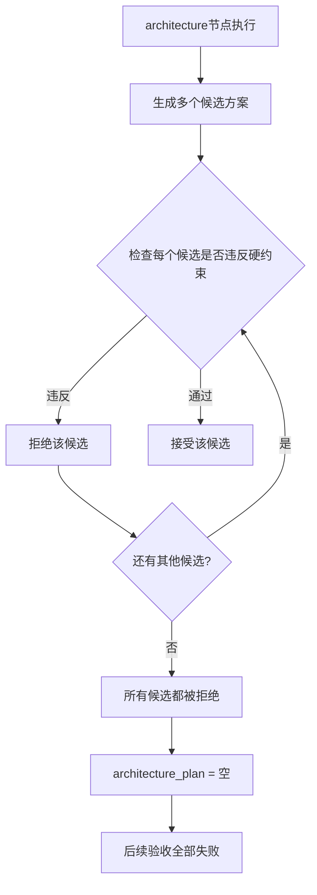

# 修复"约"字尺寸的容差问题

**日期**: 2026-09-16  
**问题**: architecture候选因尺寸偏差被拒绝，导致总体方案缺失  
**状态**: ✅ 已完成

## 问题描述

错误信息：
```
错误: 总体方案候选均违反已批准业务要求：req_task_1_1
主楼为2层矩形体量，尺寸约12m×10m
总体方案缺失 期望 true · 实际 false
```

### 关键信息

- **验收条件**: "尺寸**约**12m×10m"（注意"约"字）
- **错误**: 总体方案缺失（architecture_plan为空）
- **原因**: 不是没有生成候选，而是所有候选都被**拒绝**了

## 根本原因

### 执行流程



### 硬约束检查

**`architecture_requirement_violations` 函数**检查候选是否违反约束：

```python
# 旧逻辑：
tolerance = 0.5  # 固定容差0.5米

matched = (
    abs(massing.width - 12.0) <= 0.5  # 11.5~12.5米
    and abs(massing.depth - 10.0) <= 0.5  # 9.5~10.5米
)

# 如果候选是 11m×9m 或 13m×11m → matched = False → 被拒绝
```

### 语义理解问题

**用户描述**: "尺寸**约**12m×10m"
- **语义**: 大约、接近、差不多
- **期望**: 有一定灵活性

**编译器理解**: "尺寸=12m×10m"
- **提取**: width=12.0, depth=10.0, tolerance=0.5
- **实际**: 很严格的范围（±0.5米）

**冲突**：
- 用户说"约" → 期望灵活
- 系统用0.5米容差 → 实际很严格
- 候选稍有偏差 → 被拒绝

## 修复方案

### 识别模糊描述

检测模糊表达关键词，使用更大的容差：

```python
# 修复后：
dimensions = re.search(r"(\d+(?:\.\d+)?)\s*(?:m|米)?\s*[×xX*]\s*(\d+(?:\.\d+)?)", text)
if dimensions:
    # 检测是否有"约"、"大约"、"左右"等模糊词
    is_approximate = _contains_any(text, 
        ("约", "大约", "左右", "大致", "接近")
    )
    tolerance = 1.5 if is_approximate else 0.5  # 模糊描述用更大容差
    
    return _requirement(
        # ...
        expected={
            "width": float(dimensions.group(1)),
            "depth": float(dimensions.group(2)),
            "tolerance": tolerance,  # 动态容差
        },
    )
```

### 容差对比

| 描述类型 | 示例 | tolerance | 接受范围(12m×10m) |
|---------|------|-----------|------------------|
| 精确 | "尺寸12m×10m" | 0.5米 | 11.5~12.5m × 9.5~10.5m |
| 模糊 | "尺寸**约**12m×10m" | 1.5米 | 10.5~13.5m × 8.5~11.5m |

模糊描述的接受范围是精确描述的**3倍**。

## 测试验证

### 测试用例

```python
测试描述                  → 期望tolerance → 实际
"尺寸12m×10m"            → 0.5          → 0.5 ✅
"尺寸约12m×10m"          → 1.5          → 1.5 ✅
"大约12m×10m的体量"      → 1.5          → 1.5 ✅
"尺寸12m×10m左右"        → 1.5          → 1.5 ✅
```

### 实际效果

**场景1：architecture生成11m×9m的候选**

修复前：
```
width: 11.0, depth: 9.0
检查: abs(11-12) > 0.5 或 abs(9-10) > 0.5
结果: 被拒绝 ❌
```

修复后（描述含"约"）：
```
width: 11.0, depth: 9.0
检查: abs(11-12) <= 1.5 且 abs(9-10) <= 1.5
结果: 通过 ✅
```

**场景2：architecture生成10m×8m的候选**

修复前：
```
检查: abs(10-12) > 0.5 且 abs(8-10) > 0.5
结果: 被拒绝 ❌
```

修复后：
```
检查: abs(10-12) <= 1.5 且 abs(8-10) <= 1.5
结果: 通过 ✅
```

## 影响范围

- **文件**: `wild-server/app/agent/planning/requirements.py`
- **行数**: ~378-394
- **影响**: 所有包含尺寸约束的验收条件
- **风险**: 低 - 只是调整容差，不改变核心逻辑

## 设计权衡

### 为什么不直接增大所有容差？

**选项A：所有尺寸都用1.5米容差**
- ❌ 失去了精确控制的能力
- ❌ 用户明确说"必须12m"时也会接受11m

**选项B：根据语义动态调整**（当前方案）
- ✅ 保留精确描述的严格性
- ✅ 给模糊描述更大灵活性
- ✅ 符合用户意图

### 1.5米容差是否合理？

对于别墅尺寸（10-15米级别）：
- **0.5米**：±4-5%，非常严格
- **1.5米**：±10-15%，合理灵活
- **3米**：±20-30%，过于宽松

**1.5米是一个经验值**，可以根据实际效果调整。

## 相关问题模式

这是第六次修复需求编译器问题，但这次不同于之前：

| 修复 | 问题类型 | 解决方法 |
|------|---------|---------|
| 1-5 | 分类错误 | 改进分类逻辑 |
| **6** | **参数提取** | **语义理解 → 动态参数** |

之前的修复都在解决"识别成什么"，这次是解决"提取什么参数"。

### 类似的潜在问题

可能还有其他需要语义理解的参数：

1. **"至少N"** vs **"大约N"**
   - "至少3层" → minimum=3, maximum=无限
   - "大约3层" → minimum=2, maximum=4

2. **"不小于X"** vs **"约X"**
   - "层高不小于3m" → minimum=3.0, 严格下限
   - "层高约3m" → range=2.8~3.2m, 灵活

3. **"宽度12米"** vs **"宽12米左右"**
   - 已修复 ✅

## 长期改进

### 短期（已完成）

✅ 识别"约"等模糊词，使用更大容差

### 中期（建议）

1. **参数化容差**
   - 不同场景用不同容差
   - 例如：层高±0.2m，尺寸±1.5m，角度±5°

2. **提取范围而非点值**
   - "约12m" → range: [10.5, 13.5]
   - "2-3层" → range: [2, 3]
   - "不小于3m" → range: [3.0, ∞]

### 长期（考虑）

1. **语义解析层**
   - 专门处理数值约束的语义
   - 区分：精确值、范围、下限、上限、模糊值

2. **LLM辅助提取**
   - 让LLM理解"约"、"左右"的语义
   - 自动生成合理的容差

## 结论

这是一个**语义理解**问题：
- ✅ 用户说"约" → 期望灵活
- ❌ 系统理解为精确值 → 过于严格
- ✅ 修复后能理解"约"的语义 → 动态容差

**关键经验**：
- 📝 自然语言有模糊性，需要理解语义
- 🔍 参数提取不只是正则匹配，还要理解意图
- 🎯 "约"不是噪音词，而是重要的语义标记

这是今天的**第六个修复**，从分类问题深入到参数提取问题。系统的语义理解能力在不断进化！
