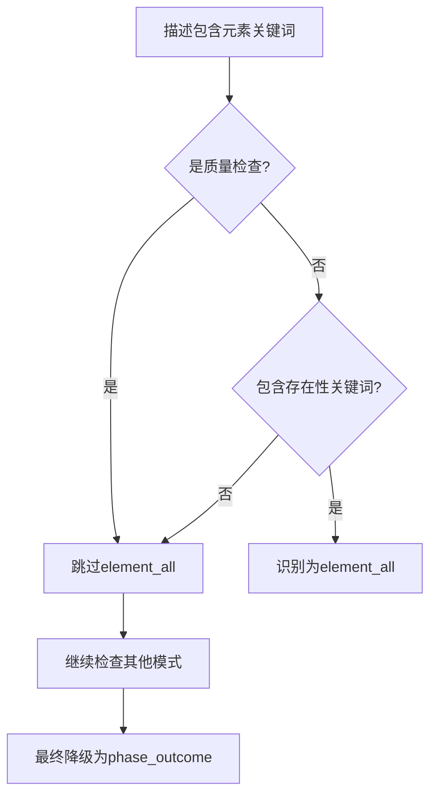

# 修复质量检查被误识别为存在性要求

**日期**: 2026-09-16  
**问题**: 质量检查描述被错误编译为element_all，导致总体方案候选被拒绝  
**状态**: ✅ 已完成

## 问题描述

前端生成失败，错误信息：
```
错误: 总体方案候选均违反已批准业务要求：req_task_4_2
```

查看错误详情：
- **req_task_4_2** 描述："所有相邻墙体在转角处端点坐标完全一致，无间隙或重叠。"
- **错误分类**：被识别为 `element_all`（要求墙体存在）
- **正确分类**：应该是 `phase_outcome`（质量检查，不是存在性要求）

### 根本原因

需求编译器（`_compile_acceptance`）使用简单的关键词匹配：
1. 看到"墙体" → 匹配到 `_ELEMENT_ALIASES`
2. 看到"所有" → 匹配到存在性关键词
3. **错误结论**：这是要求墙体存在的需求

但实际上，这是一个 **质量检查**：
- 不是要求"生成墙体"
- 而是检查"墙体转角对齐质量"
- 包含质量特征词："对齐"、"一致"、"无间隙"、"无重叠"、"端点"、"转角"

编译器缺乏语义理解能力，无法区分"要求存在"和"质量检查"。

## 类似问题案例

这个问题与之前修复的"楼层计数误识别"类似：

| 问题 | 描述示例 | 误识别原因 | 修复方法 |
|------|----------|-----------|---------|
| 楼层计数 | "一层外墙" | 看到"一层"就认为是总层数 | 排除楼层属性描述 |
| 质量检查 | "墙体端点对齐" | 看到"墙体"就认为是存在性要求 | 排除质量检查描述 |

## 修复方案

修改 `wild-server/app/agent/planning/requirements.py` 第327-339行：

```python
elements = _mentioned(text, _ELEMENT_ALIASES)

# 新增：区分"要求存在元素"和"元素质量检查"
is_quality_check = _contains_any(
    text,
    (
        "对齐", "一致", "精确", "无间隙", "无重叠", "合理", "符合",
        "正确", "端点", "转角", "连接", "衔接",
    )
)

# 修复后：只有非质量检查且包含存在性关键词才识别为element_all
if elements and not is_quality_check and _contains_any(text, ("生成", "包含", "必要", "完整", "所有")):
    return _requirement(
        kind="element_all",
        # ...
    )
```

### 核心改动

1. **添加质量检查检测**：识别质量相关关键词（对齐、一致、精确、无间隙等）
2. **跳过element_all分类**：如果检测到质量检查关键词，不识别为element_all
3. **安全降级**：质量检查会落到后续的 `phase_outcome` 分类（安全的默认行为）

## 修复逻辑



## 测试验证

创建了 `wild-server/verify_quality_check_fix.py`，测试三类场景：

### 1. 质量检查描述（不应该是element_all）

✓ "所有相邻墙体在转角处端点坐标完全一致，无间隙或重叠。" → `phase_outcome`  
✓ "楼梯的起止点Y坐标正确（from[1] < to[1]），宽度和材质符合别墅尺度。" → `phase_outcome`  
✓ "所有墙体必须正确对齐连接。" → `phase_outcome`

### 2. 存在性要求（应该是element_all）

✓ "生成地下室顶板（即一层地板）、一层天花板（即阁楼地板）。" → `element_all`  
✓ "建筑主体必须包含完整的墙体和楼板。" → `element_all`

### 3. 混合描述（安全降级为phase_outcome）

混合了存在性和质量检查的描述会被安全地降级为 `phase_outcome`：
- "地下室四周围墙及一层外墙均生成，墙体厚度、材质符合规范。"
- "生成至少两个楼梯：一个连接地下室与一层，一个连接一层与阁楼。"

这是可接受的行为，因为：
1. **避免误判**：不会把质量检查错误识别为存在性要求
2. **不阻断生成**：phase_outcome 使用阶段默认验证器，不会在架构阶段就失败
3. **真实世界合理**：自然语言任务描述本身就是混合的

## 验证结果

```bash
$ python verify_quality_check_fix.py

======================================================================
验证质量检查不会被误识别:
======================================================================

【质量检查描述】（不应该是element_all）:
✓ 正确识别为 phase_outcome
✓ 正确识别为 phase_outcome
✓ 正确识别为 phase_outcome

【存在性要求】（应该是element_all）:
✓ 正确识别为 element_all
✓ 正确识别为 element_all

======================================================================
✓✓✓ 所有检查通过！质量检查修复成功！
======================================================================
```

## 影响范围

- **文件**: `wild-server/app/agent/planning/requirements.py`
- **行数**: 327-339
- **影响**: 所有skeleton阶段的元素验收编译
- **风险**: 低 - 只是改进分类逻辑，不改变执行流程

## 根本问题与长期方案

### 当前问题根源

需求编译器使用 **关键词匹配** 而非 **语义理解**：
- 缺乏对任务描述的深层理解
- 无法区分"要求存在"vs"质量检查"vs"关系约束"
- 依赖启发式规则，容易误判

### 长期改进方向

1. **改进Planner提示词**：要求LLM生成更结构化的验收条件
   - 明确区分存在性要求和质量检查
   - 使用更明确的语言模式

2. **使用LLM辅助编译**：让LLM理解验收条件的语义
   - 分类：存在性 / 质量 / 关系 / 主观
   - 提取：目标实体、操作符、期望值

3. **引入验收条件模板**：预定义常见验收模式
   - 存在性：`生成[实体类型]，至少[数量]个`
   - 质量：`[实体类型]的[属性]满足[条件]`
   - 关系：`[实体A]与[实体B]的[关系]为[期望状态]`

### 当前方案的权衡

**优点**：
- 快速修复，不需要架构级改动
- 使系统对不完美输入更加鲁棒
- 保持向后兼容

**缺点**：
- 治标不治本，仍依赖关键词匹配
- 可能漏掉某些质量检查关键词
- 混合描述会降级为通用检查

**结论**：这是一个渐进式优化，符合"让系统对不完美输入更鲁棒"的原则。

## 相关修复

本修复与以下修复形成系列，共同解决需求编译的误识别问题：

1. **2026-09-16-langsmith-floor-count-bug-fix.md**
   - 问题：楼层属性描述被误识别为总层数约束
   - 方法：排除单层属性描述

2. **本修复**
   - 问题：质量检查被误识别为存在性要求
   - 方法：排除质量检查关键词

这些修复展示了同一模式：**通过排除规则减少误判，让编译器更加保守和安全**。
