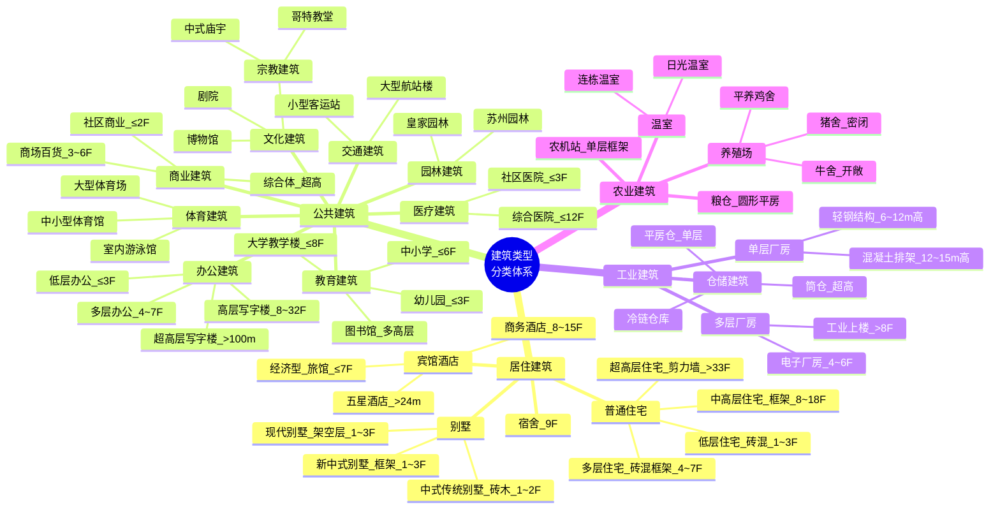

# 建筑类型分类体系（构件清单版）

> **定位**：这是 WILD 蓝图引擎的**构件配方手册**——每种建筑类型用哪些构件、什么参数、如何组装。
>
> - 构件体系：22 种 WILD 构件（详见《WILD蓝图构件与组合方式完整规范》）
> - 坐标体系：Y 轴 = 高度轴，XZ 平面 = 水平面
> - 依据：GB 50352-2019、GB 50099-2011、JGJ 62-2014、GB 51039-2014

---

## 建筑分类思维导图



> 四大类 → 16 种子类 → 各自按**层高**和**风格**继续下钻。每种子类在本手册中对应一套完整的 WILD 构件配方。

---

## 目录

- [零、WILD 构件速查](#零wild-构件速查)
- [X. 墙体、门、窗深度分类与组装规则](#x-墙体门窗深度分类与组装规则)
  - [X.1 墙体分类](#x1-墙体分类)
  - [X.2 门分类](#x2-门分类)
  - [X.3 窗分类（核心）](#x3-窗分类核心)
- [一、居住建筑](#一居住建筑)
  - [1.1 别墅](#11-别墅低层-13f)
    - [1.1.1 现代别墅（架空层）](#111-现代别墅架空层)
    - [1.1.2 中式传统别墅](#112-中式传统别墅)
    - [1.1.3 新中式别墅](#113-新中式别墅)
  - [1.2 普通住宅](#12-普通住宅低层超高层)
  - [1.3 宿舍](#13-宿舍9f)
  - [1.4 宾馆/酒店](#14-宾馆酒店)
- [二、公共建筑](#二公共建筑)
  - [2.1 教育建筑](#21-教育建筑)
  - [2.2 办公建筑](#22-办公建筑)
  - [2.3 文化建筑](#23-文化建筑)
  - [2.4 商业建筑](#24-商业建筑)
  - [2.5 体育建筑](#25-体育建筑)
  - [2.6 医疗建筑](#26-医疗建筑)
  - [2.7 交通建筑](#27-交通建筑)
  - [2.8 园林/纪念/司法](#28-园林纪念司法)
- [三、工业建筑](#三工业建筑)
- [四、农业建筑](#四农业建筑)
- [五、构件组装规则总表](#五构件组装规则总表)

---

## 零、WILD 构件速查

> 完整规范见《WILD蓝图构件与组合方式完整规范》，此处仅列本文用到的 22 种构件速查卡。

### 结构构件（承重骨架）

| 构件 | type | 核心参数 | 变体 |
|:---:|:---:|:---|:---|
| 柱子 | `column` | base, height, crossSection, style | 截面: circular/square/rectangular；风格: doric/ionic/corinthian/modern/chinese_wooden |
| 梁 | `beam` | from, to, crossSection, width, height | 截面: rect/circular/i-beam；支持曲线梁 |
| 楼板 | `floor` | from, to, thickness, shape | 形状: rect/circle；支持 surfaces 纹理 |
| 桁架 | `truss` | from, to, height, trussType | 形式: king_post/queen_post/fink/howe/pratt/warren |

### 围护构件（空间封闭）

| 构件 | type | 核心参数 | 变体 |
|:---:|:---:|:---|:---|
| 墙体 | `wall` | from, to, thickness, curve | 曲线: line/arc/ellipse/catenary |
| 屋顶 | `roof` | position, span, depth, height, roofType | 类型: gable/hip/dome/flat/chinese_curved/chinese_pagoda |
| 洞口 | `opening` | parentWall, from, width, height, style | 风格: rectangular/arched/gothic/circular |
| 门 | `door` | parentOpening, style, leafCount, hingeSide | 风格: flush/panel/glass/louvered |
| 窗 | `window` | parentOpening, sashType, muntinPattern | 窗扇: fixed/casement/sliding/awning/sash |
| 窗棂 | `mullion` | parentOpening, pattern, cols, rows | 图案: grid/vertical/horizontal/cross/custom |

### 辅助构件（功能附加）

| 构件 | type | 核心参数 | 变体 |
|:---:|:---:|:---|:---|
| 楼梯 | `stair` | from, to, width, stepCount, autoRailing | 自动推算踏步 |
| 坡道 | `ramp` | from, to, width, slope, surface | surface: flat/grooved/brushed |
| 栏杆 | `railing` | path, height, postSpacing, infill | 填充: none/vertical_bar/horizontal_bar/glass/mesh |
| 檐口 | `cornice` | parentWall, profile, position | position: top/bottom/middle |
| 烟囱 | `chimney` | base, height, crossSection, penetrateRoof | capType: none/simple/corbeled |
| 雨棚 | `canopy` | parentWall, anchor, projection, supportType | 支撑: none/bracket/post/cable |
| 家具 | `furniture` | position, dimensions, subtype | 子类型: table/chair/bed/lamp/bookshelf/tile |
| 贴附 | `placement` | onSurface.parent, rows, cols | 网格批量实例 |
| 地形 | `terrain` | origin, size, heightmap, surfaceZones | 高度图地表 |
| 模板 | `templates` | 定义 + instances 偏移复用 | 深拷贝批量生成 |

---

## X. 墙体、门、窗深度分类与组装规则

> **本章定位**：将 WILD 中最常用的三大围护构件（wall / door / window）按**建筑风格**和**构件组合方式**做逐级细分。每种门窗造型 = 一组 WILD 子构件的组装公式。

---

### X.1 墙体分类

墙体在 WILD 中 type=**`wall`**，核心参数是 `thickness`（厚度）、`curve`（曲线形状）、`height`（高度）和 `material`（材质）。不同建筑对墙体的需求差异极大——从 120mm 隔墙到 500mm 防辐射混凝土墙，参数跨度 4 倍以上。

#### X.1.1 按受力角色分类

| 类型 | WILD 表达 | 典型厚度 | 适用结构 | 关键约束 |
|:---|:---|:---:|:---|:---|
| **承重墙** | `wall` 直接落地，上方搁楼板/梁 | 240~370mm | 砖混结构、剪力墙 | 不可拆改，开洞需过梁 |
| **非承重·隔墙** | `wall` 厚度<150mm，重量由楼板/梁承担 | 100~120mm | 框架结构内部 | 轻质材料(加气混凝土/石膏板) |
| **非承重·填充墙** | `wall` 嵌于柱间 | 200~240mm | 框架结构外部/内部 | 与柱梁柔性连接 |
| **幕墙** | `wall` 悬挂于外部骨架 | 不计厚度(玻璃+龙骨) | 高层公建、商业 | 承受风荷载，需 pre-glazed |

**WILD JSON 示例**：

```json
/* 承重实墙 — 中式青砖 */
{ "type": "wall", "id": "bearing_wall_01",
  "from": [0, 0, 0], "to": [8, 0, 0],
  "height": 4.5, "thickness": 0.24,
  "curve": "line", "material": "grey_brick" }

/* 轻质隔墙 — 加气混凝土 */
{ "type": "wall", "id": "partition_01",
  "from": [3, 0, 0], "to": [3, 0, 6],
  "height": 3.0, "thickness": 0.12,
  "curve": "line", "material": "aac_block" }

/* 玻璃幕墙 — 悬挂式 */
{ "type": "wall", "id": "curtain_wall_01",
  "from": [0, 0, 0], "to": [18, 0, 0],
  "height": 30.0, "thickness": 0.02,
  "curve": "line", "material": "glass_curtain" }
```

#### X.1.2 按材料分类

| 材料 | thickness | material 值 | 适用建筑 | 特征 |
|:---|:---:|:---|:---|:---|
| **烧结粘土砖** | 240mm | `red_brick` / `grey_brick` | 住宅、学校、中式别墅 | 双面抹灰后 280mm |
| **加气混凝土砌块** | 100~250mm | `aac_block` | 填充墙、隔墙 | 轻质保温，不可承重 |
| **钢筋混凝土** | 160~500mm | `concrete` / `reinforced_concrete` | 剪力墙、核心筒、地下室 | 可承重，刚度大 |
| **石材** | 300~600mm | `stone_rubble` / `stone_ashlar` | 山区民居、欧式庄园、园林 | 天然质感，自重极大 |
| **木材** | 50~150mm | `wood_plank` / `wood_log` | 木屋、中式古建隔断 | 轻质，需防火处理 |
| **玻璃(幕墙)** | 不计 | `glass_curtain` | 高层办公、商业 | 透光，需龙骨框架 |
| **彩钢板/夹芯板** | 50~100mm | `steel_sandwich` | 厂房、养殖场、仓储 | 轻钢+保温芯材 |
| **夯土** | 400~600mm | `rammed_earth` | 生土建筑、生态民宿 | 天然质感，热惰性好 |

#### X.1.3 按构造方式分类

| 构造 | 描述 | WILD 实现方式 |
|:---|:---|:---|
| **实体墙** | 单一材料不留空隙 | 一条 `wall` 即可 |
| **空斗墙** | 砖砌中留空腔 | `wall` thickness=0.24 + 内部 cavity 标记 |
| **复合墙** | 两种以上材料叠合 | 两条 `wall` 紧贴（如外砖+内保温层） |
| **幕墙** | 骨架+面板悬挂 | `wall` + 外侧 `placement` 排列玻璃单元 |

#### X.1.4 按风格/饰面分类（与建筑类型对照）

```
墙体风格选型一览

┌────────────────────────────────────────────────────────┐
│ 现代风格    │ concrete(白色清水)  │ 现代别墅、办公     │
│ 中式传统    │ grey_brick(青砖/白墙)│ 四合院、中式别墅   │
│ 新中式      │ white_plaster(白墙)  │ 新中式别墅、酒店   │
│ 欧式古典    │ stone_ashlar(方石砌) │ 欧式庄园、博物馆   │
│ 工业风格    │ steel_sandwich(彩钢) │ 厂房、仓库         │
│ 生态风格    │ rammed_earth(夯土)   │ 生态民宿、游客中心 │
│ 高技风格    │ glass_curtain(玻璃)  │ 超高层写字楼、商业 │
└────────────────────────────────────────────────────────┘
```

#### X.1.5 墙体模数规格总表

| 名称 | 图纸标注 | 实际厚度 | 材料 | 每 m² 用砖(标砖) | 适用层数 |
|:---|:---:|:---:|:---|:---:|:---|
| 半砖墙 | 120mm | 115mm | 粘土砖 | 64 块 | 隔墙 |
| 一砖墙 | 240mm | 240mm | 粘土砖 | 128 块 | 承重≤6F |
| 一砖半墙 | 370mm | 365mm | 粘土砖 | 192 块 | 承重≤8F |
| 二砖墙 | 490mm | 490mm | 粘土砖 | 256 块 | 承重高层 |
| RC 承重墙 | 160mm | 160mm | 钢筋混凝土 | — | 剪力墙高层 |
| RC 隔墙 | 50mm | 50mm | 钢筋混凝土 | — | 非承重 |
| 加气砼外墙 | 200~250mm | 200~250mm | 加气混凝土 | — | 填充墙 |
| 加气砼隔墙 | 100~150mm | 100~150mm | 加气混凝土 | — | 内隔墙 |

---

### X.2 门分类

门在 WILD 中有两个关键构件：**`opening`**（洞口）定义墙上的开洞尺寸和形状，**`door`**（门扇）定义可开合实体。复杂造型的门 = `opening` + `door` + `mullion` + `window`（门亮子）+ `cornice`（门楣装饰）。

#### X.2.1 按开启方式分类

| 开启方式 | WILD door.leafCount | hingeSide | 特点 | 适用场景 |
|:---|:---:|:---|:---|:---|
| **平开门(单扇)** | 1 | left/right | 最常用，内开或外开 | 住宅卧室、办公室 |
| **平开门(双扇)** | 2 | left+right | 大开间入口 | 客厅、酒店大堂 |
| **推拉门** | 1~2 | — (滑动) | 不占空间，密封差 | 阳台、衣帽间 |
| **折叠门** | ≥2 | — (折叠) | 全开敞 | 商铺门面、庭院 |
| **转门** | 3~4（旋转体） | — | 防气流，恒温 | 酒店/写字楼入口 |
| **卷帘门** | 1（卷轴式） | — | 占高不占深 | 厂房、车库 |

**WILD 门的核心参数**：

| 参数 | 说明 | 可选值 |
|:---|:---|:---|
| `style` | 门扇样式 | `flush`(平板) / `panel`(嵌板) / `glass`(玻璃) / `louvered`(百叶) |
| `leafCount` | 门扇数 | 1(单扇) / 2(双扇) / 4(四扇折叠) |
| `hingeSide` | 铰链侧 | `left` / `right` |
| `swingDirection` | 开启方向 | `inward` / `outward` |
| `material` | 材质 | `wood_oak` / `steel` / `glass_tempered` / `aluminum` |

#### X.2.2 中式传统门 —— 构件组装公式


**A. 实榻门（宫殿/城门）**

> 组装公式：**`opening`(rectangular, 超大) + `door`(leafCount=2, style=panel, 实木厚板) + `placement`(门钉阵列, 铜钉) + `cornice`(门簪)**

```
实榻门 = opening(高5~9m) + door(双扇, 240mm厚木板)
       + placement(门钉 9×9=81, 贴附于门扇表面)
       + cornice(门楣, 装饰横枋)
```

| 子构件 | type | 关键参数 |
|:---:|:---:|:---|
| 门洞 | `opening` | style=rectangular, width=3.6~5.4m, height=5~9m |
| 门扇 | `door` | style=panel, leafCount=2, material=wood_hardwood |
| 门钉 | `placement` | 贴附于 door, rows=9, cols=9, object=半球体铜钉 |
| 门楣 | `cornice` | 洞口上方横枋, position=top |

**WILD JSON 示例——故宫太和殿式实榻门**：

```json
/* 实榻门 — 宫殿大门，高宽比约 1:0.6 */
{ "type": "opening", "id": "shitamen_opening",
  "parentWall": "palace_wall", "from": [4.0, 0, 0],
  "width": 4.2, "height": 6.6, "style": "rectangular" },
{ "type": "door", "id": "shitamen_door",
  "parentOpening": "shitamen_opening",
  "style": "panel", "leafCount": 2, "hingeSide": "left",
  "material": "hardwood", "thickness": 0.24 },
/* 门钉阵列 — placement 贴附于门扇表面，9×9=81 颗 */
{ "type": "placement", "id": "shitamen_nails",
  "parentId": "shitamen_door",
  "rows": 9, "cols": 9, "object": "半球体铜钉" },
/* 门楣 — 门洞上方的装饰横枋 */
{ "type": "cornice", "id": "shitamen_cornice",
  "parentOpening": "shitamen_opening",
  "profile": "rectangular", "position": "top",
  "overhang": 0.15, "material": "wood" }
```

---

**B. 隔扇门（厅堂/宫殿内檐）**

> 组装公式：**`opening`(rectangular, 瘦高) + `door`(leafCount=4~8, style=panel) + `mullion`(棂花图案, grid/custom) + `placement`(裙板浮雕)**

隔扇门是中式建筑使用最广的门，既是门又是窗。每扇高宽比约 4:1，上部 2/3 为透光棂心（`mullion`），下部 1/3 为实心裙板。

```
隔扇门 = opening(宽0.6~0.9m/扇, 高3~4m)
        + 多扇 door(leafCount=4~8, 偶数排列)
        + mullion(在每扇上部, pattern=custom/步步锦/灯笼锦/冰裂纹)
        + 裙板 placement(下部浮雕, 如意纹/花卉)
```

| 子构件 | type | 关键参数 |
|:---:|:---:|:---|
| 门洞 | `opening` | style=rectangular, width=0.6~0.9m/扇, height=3~4m |
| 门扇骨架 | `door` | style=panel, leafCount=4|6|8, material=wood_nanmu |
| 棂心 | `mullion` | parentOpening=门洞, pattern=custom, 图案=步步锦/灯笼锦/冰裂纹 |
| 绦环板 | `placement` | 位于棂心与裙板之间, object=横板条 |
| 裙板 | `placement` | 位于下部, object=木板+浮雕 |

**WILD JSON 示例——四扇隔扇门**：

```json
/* 四扇隔扇门 — 明间厅堂入口 */
{ "type": "opening", "id": "geshan_opening_01",
  "parentWall": "mingjian_wall", "from": [2.4, 0, 0],
  "width": 3.2, "height": 3.6, "style": "rectangular" },
{ "type": "mullion", "id": "geshan_mullion_01",
  "parentOpening": "geshan_opening_01",
  "pattern": "custom", "patternName": "bubujin",
  "cols": 8, "rows": 12 },
{ "type": "door", "id": "geshan_door_01",
  "parentOpening": "geshan_opening_01",
  "style": "panel", "leafCount": 4,
  "hingeSide": "left", "material": "wood_nanmu" }
```

**C. 其他中式门型速查**

| 门型 | 组装公式 | leafCount | 特征 |
|:---|:---|:---:|:---|
| **棋盘门(攒边门)** | opening + door(panel, 2扇) + 角叶placement | 2 | 四边框+心板，民居大门 |
| **撒带门** | opening + door(panel, 单边无框) | 1 | 一侧无边，小院落外门 |
| **屏门(镜面门)** | opening + door(flush, 4~6扇) | 4~6 | 无棂花，素面，垂花门后 |
| **垂花门** | opening + door(2扇) + cornice(垂莲柱) + roof(gable小顶) | 2 | 二门制，前后檐悬垂莲柱 |

**WILD JSON 示例——棋盘门（民居大门）**：

```json
{ "type": "opening", "id": "qipan_opening",
  "parentWall": "courtyard_wall", "from": [0, 0, 0],
  "width": 1.8, "height": 2.4, "style": "rectangular" },
{ "type": "door", "id": "qipan_door",
  "parentOpening": "qipan_opening",
  "style": "panel", "leafCount": 2, "hingeSide": "left",
  "material": "wood_elm" }
```

**WILD JSON 示例——垂花门（四合院二门）**：

```json
/* 垂花门 = 双扇门 + 悬垂莲柱(前后) + 小屋顶 */
{ "type": "opening", "id": "chuihua_opening",
  "parentWall": "ermen_wall", "from": [0, 0, 0],
  "width": 2.4, "height": 2.8, "style": "rectangular" },
{ "type": "door", "id": "chuihua_door",
  "parentOpening": "chuihua_opening",
  "style": "panel", "leafCount": 2,
  "material": "wood_nanmu" },
{ "type": "cornice", "id": "chuihua_verandah_front",
  "parentOpening": "chuihua_opening",
  "profile": "hanging_lotus", "position": "top",
  "overhang": 1.2, "material": "wood" },
{ "type": "roof", "id": "chuihua_roof",
  "plan": [[-1.2,0],[3.6,0],[3.6,2.4],[-1.2,2.4]],
  "roofType": "gable", "height": 3.5, "overhang": 0.9,
  "material": "grey_clay_tile" }
```

**WILD JSON 示例——屏门（镜面门，垂花门后）**：

```json
{ "type": "opening", "id": "pingmen_opening",
  "parentWall": "screen_wall", "from": [0, 0, 0],
  "width": 3.6, "height": 2.4, "style": "rectangular" },
{ "type": "door", "id": "pingmen_door",
  "parentOpening": "pingmen_opening",
  "style": "flush", "leafCount": 4,
  "material": "wood_pine", "paint": "green" }
```

#### X.2.3 欧式古典门 —— 构件组装公式


---

**A. 嵌板门（Panel Door）**——欧洲最通用的古典门型

> 组装公式：**`opening`(rectangular) + `door`(panel, leafCount=1, 横竖框分割 6 嵌板)**

```
嵌板门 = opening(标准门洞, w=0.9~1.2m, h=2.1~2.4m)
        + door(style=panel, 横3条+竖2条中挺 → 6格嵌板)
```

| 子构件 | type | 关键参数 |
|:---:|:---:|:---|
| 门洞 | `opening` | style=rectangular, width=1.0m, height=2.1m |
| 门扇 | `door` | style=panel, leafCount=1, material=wood_oak |

```json
{ "type": "opening", "id": "panel_door_opening",
  "parentWall": "european_hall", "from": [2.0, 0, 0],
  "width": 1.0, "height": 2.1, "style": "rectangular" },
{ "type": "door", "id": "panel_door",
  "parentOpening": "panel_door_opening",
  "style": "panel", "leafCount": 1, "hingeSide": "left",
  "material": "wood_oak", "panels": [2, 3] }
```

---

**B. 平板门（Flush Door）**——现代简化版欧式门

> 组装公式：**`opening`(rectangular) + `door`(flush)**

```
平板门 = opening(标准) + door(flush, 素面无嵌板, 可烤漆/贴面)
```
| 子构件 | type | 关键参数 |
|:---:|:---:|:---|
| 门洞 | `opening` | style=rectangular, width=0.9m, height=2.1m |
| 门扇 | `door` | style=flush, leafCount=1, material=wood_pine |

```json
{ "type": "opening", "id": "flush_door_opening",
  "parentWall": "hotel_corridor", "from": [1.5, 0, 0],
  "width": 0.9, "height": 2.1, "style": "rectangular" },
{ "type": "door", "id": "flush_door",
  "parentOpening": "flush_door_opening",
  "style": "flush", "leafCount": 1,
  "material": "wood_pine" }
```

---

**C. 法式门（French Door）**——通向花园/阳台的双扇玻璃门

> 组装公式：**`opening`(arched/rect) + `mullion`(grid, cols=2 rows=3) + `door`(glass, leafCount=2)**

```
法式门 = opening(宽1.8m, 高2.4m)
        + mullion(grid, 每扇 2列×3行玻璃分格)
        + door(glass, 双扇外开, 白色木框)
```

| 子构件 | type | 关键参数 |
|:---:|:---:|:---|
| 门洞 | `opening` | style=rectangular, width=1.8m, height=2.4m |
| 玻璃分格 | `mullion` | pattern=grid, cols=2, rows=3 |
| 门扇 | `door` | style=glass, leafCount=2, swingDirection=outward |

```json
{ "type": "opening", "id": "french_door_opening",
  "parentWall": "garden_wall", "from": [3.0, 0, 0],
  "width": 1.8, "height": 2.4, "style": "rectangular" },
{ "type": "mullion", "id": "french_mullion",
  "parentOpening": "french_door_opening",
  "pattern": "grid", "cols": 2, "rows": 3 },
{ "type": "door", "id": "french_door",
  "parentOpening": "french_door_opening",
  "style": "glass", "leafCount": 2,
  "swingDirection": "outward", "material": "wood_white" }
```

---

**D. 荷兰门（Dutch Door）**——上下分体独立开启

> 组装公式：**2 × `opening`(上下叠加) + 2 × `door`(panel, 上半/下半独立)**

```
荷兰门 = 上半段 opening(从 1.1m 到顶)
         + door(panel, 单扇, 可独立内开→通风)
       + 下半段 opening(从地面到 1.1m)
         + door(panel, 单扇, 可锁→防畜)
```

| 子构件 | type | 关键参数 |
|:---:|:---:|:---|
| 上段洞口 | `opening` | from y=1.1, width=1.0m, height=1.0m |
| 上段门扇 | `door` | style=panel, leafCount=1, hingeSide=left |
| 下段洞口 | `opening` | from y=0, width=1.0m, height=1.1m |
| 下段门扇 | `door` | style=panel, leafCount=1, hingeSide=left |

```json
{ "type": "opening", "id": "dutch_upper_opening",
  "parentWall": "farmhouse_wall", "from": [1.0, 1.1, 0],
  "width": 1.0, "height": 1.0, "style": "rectangular" },
{ "type": "door", "id": "dutch_upper_door",
  "parentOpening": "dutch_upper_opening",
  "style": "panel", "leafCount": 1, "hingeSide": "left" },
{ "type": "opening", "id": "dutch_lower_opening",
  "parentWall": "farmhouse_wall", "from": [1.0, 0, 0],
  "width": 1.0, "height": 1.1, "style": "rectangular" },
{ "type": "door", "id": "dutch_lower_door",
  "parentOpening": "dutch_lower_opening",
  "style": "panel", "leafCount": 1, "hingeSide": "left" }
```

---

**E. 拱形大门（Arched Entrance）**——教堂/市政厅入口

> 组装公式：**`opening`(arched, 高宽比 2:1) + `door`(panel, leafCount=2, 厚重木板) + `cornice`(拱顶石)**

```
拱形大门 = opening(arched, w=1.8~3.6m, h=3.6~8m)
          + door(panel, 双扇, 拼板, 铁质铰链)
          + cornice(拱顶石, 拱顶部中心)
```

| 子构件 | type | 关键参数 |
|:---:|:---:|:---|
| 拱形洞口 | `opening` | style=arched, width=2.4m, height=5.0m |
| 门扇 | `door` | style=panel, leafCount=2, material=wood_oak |
| 拱顶石 | `cornice` | profile=keystone, position=top, parentOpening=拱洞 |

```json
{ "type": "opening", "id": "arched_entrance",
  "parentWall": "church_facade", "from": [6.0, 0, 0],
  "width": 2.4, "height": 5.0, "style": "arched" },
{ "type": "door", "id": "arched_door",
  "parentOpening": "arched_entrance",
  "style": "panel", "leafCount": 2,
  "material": "wood_oak", "thickness": 0.08 },
{ "type": "cornice", "id": "arched_keystone",
  "parentOpening": "arched_entrance",
  "profile": "keystone", "position": "top" }
```

---

#### X.2.4 现代门 —— 构件组装公式


---

**A. 玻璃推拉门（Sliding Glass Door）**

> 组装公式：**`opening`(rect, 宽 1.8~3.6m) + `door`(glass, leafCount=2, 滑轨模式)**

| 子构件 | type | 关键参数 |
|:---:|:---:|:---|
| 门洞 | `opening` | style=rectangular, width=2.4m, height=2.4m |
| 玻璃门扇 | `door` | style=glass, leafCount=2, mechanism=sliding |

```json
{ "type": "opening", "id": "sliding_door_opening",
  "parentWall": "shop_front", "from": [2.0, 0, 0],
  "width": 2.4, "height": 2.4, "style": "rectangular" },
{ "type": "door", "id": "sliding_door",
  "parentOpening": "sliding_door_opening",
  "style": "glass", "leafCount": 2, "mechanism": "sliding",
  "material": "aluminum", "glassType": "tempered" }
```

---

**B. 自动感应门（Automatic Sensor Door）**

> 组装公式：**`opening`(rect, 宽 3~6m) + `door`(glass, leafCount=2~4, 传感器+电机驱动)**

| 子构件 | type | 关键参数 |
|:---:|:---:|:---|
| 门洞 | `opening` | style=rectangular, width=4.0m, height=2.4m |
| 玻璃门扇 | `door` | style=glass, leafCount=4(两固定+两活动), mechanism=auto_sliding |

```json
{ "type": "opening", "id": "auto_door_opening",
  "parentWall": "office_lobby", "from": [0, 0, 0],
  "width": 4.0, "height": 2.4, "style": "rectangular" },
{ "type": "door", "id": "auto_door",
  "parentOpening": "auto_door_opening",
  "style": "glass", "leafCount": 4, "mechanism": "auto_sliding",
  "sensorType": "infrared", "material": "aluminum" }
```

---

**C. 工业卷帘门（Roll-up Door）**

> 组装公式：**`opening`(rect, 宽 3~8m) + `door`(louvered, 卷轴机构, leafCount=1)**

| 子构件 | type | 关键参数 |
|:---:|:---:|:---|
| 门洞 | `opening` | style=rectangular, width=5.0m, height=5.0m |
| 卷帘门扇 | `door` | style=louvered, leafCount=1, mechanism=roll_up |

```json
{ "type": "opening", "id": "rollup_door_opening",
  "parentWall": "factory_wall", "from": [6.0, 0, 0],
  "width": 5.0, "height": 5.0, "style": "rectangular" },
{ "type": "door", "id": "rollup_door",
  "parentOpening": "rollup_door_opening",
  "style": "louvered", "leafCount": 1, "mechanism": "roll_up",
  "material": "steel_galvanized", "slatWidth": 0.1 }
```

---

**D. 气密门（医用密封门）**

> 组装公式：**`opening`(rect, 标准) + `door`(flush, 密封胶条, 闭门器)**

| 子构件 | type | 关键参数 |
|:---:|:---:|:---|
| 门洞 | `opening` | style=rectangular, width=1.2m, height=2.1m |
| 密封门扇 | `door` | style=flush, leafCount=1, seal=airtight |

```json
{ "type": "opening", "id": "airtight_door_opening",
  "parentWall": "or_wall", "from": [1.0, 0, 0],
  "width": 1.2, "height": 2.1, "style": "rectangular" },
{ "type": "door", "id": "airtight_door",
  "parentOpening": "airtight_door_opening",
  "style": "flush", "leafCount": 1,
  "material": "steel_stainless", "seal": "airtight",
  "closer": true, "panicBar": false }
```

---

**E. 防火门（Fire-rated Door）**

> 组装公式：**`opening`(rect) + `door`(flush, steel, 闭门器+顺位器)**

| 子构件 | type | 关键参数 |
|:---:|:---:|:---|
| 门洞 | `opening` | style=rectangular, width=1.0~1.5m, height=2.1m |
| 防火门扇 | `door` | style=flush, leafCount=1/2, material=steel, fireRating=甲/乙/丙 |

```json
{ "type": "opening", "id": "fire_door_opening",
  "parentWall": "stairwell_wall", "from": [3.0, 0, 0],
  "width": 1.2, "height": 2.1, "style": "rectangular" },
{ "type": "door", "id": "fire_door",
  "parentOpening": "fire_door_opening",
  "style": "flush", "leafCount": 1, "hingeSide": "left",
  "material": "steel", "fireRating": "乙级_1h",
  "closer": true, "panicBar": true, "swingDirection": "outward" }
```

---

---

#### X.2.5 门-构件组装关系总表

| 门型 | opening.style | door.style | door.leafCount | mullion | cornice/placement | 子构件数 |
|:---|:---:|:---:|:---:|:---:|:---:|:---:|
| **实榻门(宫殿)** | rectangular | panel | 2 | — | placement(门钉)+cornice(门楣) | 4 |
| **隔扇门(厅堂)** | rectangular | panel | 4~8 | custom(棂花) | placement(裙板) | 4 |
| **棋盘门(民居)** | rectangular | panel | 2 | — | placement(角叶) | 3 |
| **垂花门(二门)** | rectangular | panel | 2 | — | cornice(垂莲柱)+roof | 4 |
| **屏门(镜面)** | rectangular | flush | 4~6 | — | — | 2 |
| **嵌板门(欧式)** | rectangular | panel | 1 | — | — | 2 |
| **平板门(欧式)** | rectangular | flush | 1 | — | — | 2 |
| **法式门** | rect/arched | glass | 2 | grid(2×3) | — | 3 |
| **荷兰门** | rect×2(上下) | panel | 1+1 | — | — | 4 |
| **拱形大门** | arched | panel | 2 | — | cornice(拱顶石) | 3 |
| **玻璃推拉门** | rectangular | glass | 2 | — | — | 2 |
| **自动感应门** | rectangular | glass | 4 | — | — | 2 |
| **工业卷帘门** | rectangular | louvered | 1(卷轴) | — | — | 2 |
| **气密门(医用)** | rectangular | flush | 1 | — | — | 2 |
| **防火门** | rectangular | flush | 1~2 | — | — | 2 |

> **图例**：子构件数 = opening + door + mullion + 装饰件(cornice/placement/roof) 合计。

#### X.2.6 门型与建筑类型速配

| 建筑类型 | 推荐门型 | 说明 |
|:---|:---|:---|
| 中式传统别墅 | 棋盘门 + 垂花门 + 屏门 | 四合院大门+二门+屏门三进制 |
| 宫殿/庙宇 | 实榻门 + 隔扇门 | 威严+可拆卸全开 |
| 新中式别墅 | 简化隔扇门(玻璃+棂花) + 法式门 | 传统符号+现代采光 |
| 现代别墅 | 法式门 + 玻璃推拉门 | 大面积玻璃+花园贯通 |
| 欧式庄园 | 嵌板门 + 拱形大门 | 古典比例+仪式感入口 |
| 办公超高层 | 自动感应门 + 防火门 | 大堂自动+楼梯间防火 |
| 工业厂房 | 工业卷帘门 + 防火门 | 大跨物流+消防规范 |
| 医院 | 气密门 + 自动感应门 | 手术室洁净+公共区无障碍 |
| 哥特教堂 | 拱形大门(双扇, 拱顶石) | 神圣仪式入口 |

---

### X.3 窗分类（核心）

**窗不是单一构件——它是 WILD 多个子构件协同组装的结果。**

一扇复杂窗户的完整构成：

```
窗 = opening(洞口, 在墙上打孔)
    + window(窗扇, 玻璃+可开启机制)
    + mullion(窗棂/分格, 可选, 装饰图案)
    + cornice(窗楣/窗台, 可选, 装饰线条)
```

**核心设计原则**：`opening` 决定窗的**轮廓造型**（方/拱/圆/哥特尖）；`mullion` 决定窗的**内部图案**（棂花/菱花/分格）；`window` 决定**开启方式**和**透光材质**；`cornice` 提供**装饰收边**。

#### X.3.1 按开启方式分类 —— window.sashType 映射

| 开启方式 | sashType | 特征 | 通风效率 | 密封 | 典型应用 |
|:---|:---:|:---|:---:|:---:|:---|
| **固定窗** | `fixed` | 不可开启，仅采光观景 | — | ★★★★★ | 高层幕墙、天窗 |
| **平开窗(外开)** | `casement` | 铰链侧边，向外推 | ★★★★★ | ★★★★ | 住宅、学校、别墅 |
| **平开窗(内开)** | `casement` + swingDirection=inward | 向内拉 | ★★★★★ | ★★★★★ | 欧洲常见 |
| **内开内倒** | `casement` + tiltMode | 可平开可上悬 | ★★★ | ★★★★ | 现代高层住宅 |
| **推拉窗** | `sliding` | 水平滑动 | ★★★ | ★★ | 阳台、普通住宅 |
| **上悬窗** | `awning` | 底部外推，上轴旋转 | ★★ | ★★★★ | 卫生间、高窗 |
| **下悬窗** | `hopper` | 顶部内拉，下轴旋转 | ★★ | ★★ | 地下室 |
| **中悬窗** | `pivot` | 水平中轴旋转 | ★★★★ | ★★ | 厂房、体育场 |
| **立转窗** | `pivot_vertical` | 垂直中轴旋转 | ★★★★ | ★★ | 特殊建筑 |

#### X.3.2 中式传统窗 —— 构件组装公式


中式窗的核心特征是**窗棂艺术**——在 `opening` 内部用 `mullion` 构成各种几何图案，兼具采光和装饰功能。

---

**A. 直棂窗**（最古早的中式窗型）

> 组装公式：**`opening`(rectangular) + `window`(fixed) + `mullion`(vertical, 等距排列)**

```
直棂窗 = opening(高瘦矩形)
        + mullion(pattern=vertical, 椽条断面方形, 间距=椽条宽×3)
        + window(fixed, 内侧糊纸/外侧玻璃)
```

| 子构件 | type | 关键参数 |
|:---:|:---:|:---|
| 窗洞 | `opening` | style=rectangular, width=1.0~1.5m, height=1.8~2.4m |
| 直棂 | `mullion` | pattern=vertical, cols=0(仅竖), rows=8~14, 断面=方10mm |
| 窗扇 | `window` | sashType=fixed |

**WILD JSON**：

```json
{ "type": "opening", "id": "zhiling_opening",
  "parentWall": "temple_wall", "from": [2.0, 1.2, 0],
  "width": 1.2, "height": 2.0, "style": "rectangular" },
{ "type": "mullion", "id": "zhiling_mullion",
  "parentOpening": "zhiling_opening",
  "pattern": "vertical", "cols": 0, "rows": 12 },
{ "type": "window", "id": "zhiling_window",
  "parentOpening": "zhiling_opening",
  "sashType": "fixed" }
```

---

**B. 一码三箭直棂窗**（直棂窗进阶版）

> 组装公式：**`opening`(rectangular) + `mullion`(grid, 3 rows × N cols) + `window`(fixed)**

与直棂窗的区别：在竖棂条的上、中、下部位各横穿三根水平棂条，形成 `grid` 图案。`mullion` 的 `pattern` 从 `vertical` 变为 `grid`，`rows=3`。

```json
{ "type": "opening", "id": "yima_opening",
  "parentWall": "courtyard_wall",
  "width": 1.4, "height": 1.8, "style": "rectangular" },
{ "type": "mullion", "id": "yima_mullion",
  "parentOpening": "yima_opening",
  "pattern": "grid", "cols": 16, "rows": 3 },
{ "type": "window", "id": "yima_window",
  "parentOpening": "yima_opening",
  "sashType": "fixed" }
```

---

**C. 槛窗**（与隔扇门配套的标准窗）

> 组装公式：**`opening`(rectangular, 宽=隔扇门宽, 高=隔扇门高−裙板高) + `mullion`(grid/custom, 与隔扇门棂花一致) + `window`(casement) + `wall`(槛墙, 窗下矮墙)**

```
槛窗 = 槛墙(砖砌, 高0.8~1.0m, 承托窗扇)
      + opening(宽同隔扇门, 高=隔扇门去裙板)
      + mullion(custom, 图案与相邻隔扇门统一)
      + window(casement, 可向外开启)
```

| 子构件 | type | 关键参数 |
|:---:|:---:|:---|
| 槛墙 | `wall` | height=0.8~1.0m, thickness=0.24m, material=grey_brick |
| 窗洞 | `opening` | 位于槛墙之上, width=0.6~0.9m, height=1.8~2.4m |
| 棂心 | `mullion` | pattern=grid/custom, 与同立面隔扇门使用相同 pattern |
| 窗扇 | `window` | sashType=casement, 可内外开 |

---

**D. 支摘窗**（民居经典——可支起+可摘下）

> 组装公式：**2 × [opening(上下两层) + window + mullion]** — 上层 awning(支起)，下层 casement(摘下)**

```
支摘窗 = 上段 opening(高=总高×2/3)
         + window(awning, 可推出支起)
         + mullion(grid)
       + 下段 opening(高=总高×1/3)
         + window(casement, 可拆卸摘下)
         + mullion(grid)
```

**WILD JSON 示例**：

```json
/* 上段 — 支窗 */
{ "type": "opening", "id": "zhizhai_upper_opening",
  "parentWall": "siheyuan_wall", "from": [0.5, 1.6, 0],
  "width": 1.2, "height": 1.0, "style": "rectangular" },
{ "type": "mullion", "id": "zhizhai_upper_mullion",
  "parentOpening": "zhizhai_upper_opening",
  "pattern": "grid", "cols": 10, "rows": 6 },
{ "type": "window", "id": "zhizhai_upper_window",
  "parentOpening": "zhizhai_upper_opening",
  "sashType": "awning", "swingDirection": "outward" },

/* 下段 — 摘窗 */
{ "type": "opening", "id": "zhizhai_lower_opening",
  "parentWall": "siheyuan_wall", "from": [0.5, 0.3, 0],
  "width": 1.2, "height": 1.3, "style": "rectangular" },
{ "type": "mullion", "id": "zhizhai_lower_mullion",
  "parentOpening": "zhizhai_lower_opening",
  "pattern": "grid", "cols": 10, "rows": 8 },
{ "type": "window", "id": "zhizhai_lower_window",
  "parentOpening": "zhizhai_lower_opening",
  "sashType": "casement" }
```

---

**E. 漏窗（花窗/墙窗）**——园林灵魂

> 组装公式：**`opening`(多边形/圆形/扇形, 在砖墙上) + `mullion`(custom, 镂空图案) — 无 window 扇，仅 open frame**

漏窗是中式园林的标志元素。核心特点：**没有窗扇，只有窗洞+镂空棂条**，让墙内外景色互相渗透。

```
漏窗 = opening(自由形: 矩形/六边形/扇形/海棠形/圆形)
      + mullion(custom, 冰裂纹/万字纹/梅花纹/葵花纹)
      // 无 window 构件 — 通透无遮挡
```

| 子构件 | type | 关键参数 |
|:---:|:---:|:---|
| 窗洞 | `opening` | style=rectangular(非标准)/circular(月洞门式)/扇形, width=0.6~1.5m |
| 镂空棂条 | `mullion` | pattern=custom, 图案=冰裂纹/万字纹/梅花纹 |

```json
/* 园林冰裂纹漏窗 */
{ "type": "opening", "id": "louchuang_hexagon",
  "parentWall": "garden_wall",
  "width": 1.0, "height": 1.0, "style": "rectangular" },
{ "type": "mullion", "id": "louchuang_mullion",
  "parentOpening": "louchuang_hexagon",
  "pattern": "custom", "patternName": "ice_crack",
  "cols": 0, "rows": 0 }
/* 注意：漏窗无 window 构件 */
```

---

**F. 空窗（洞窗/月洞门式窗）**

> 组装公式：**仅 `opening`(圆形/多边形) — 无 mullion, 无 window — 纯粹的开洞**

园林墙上的圆洞、扇形洞，无棂无扇，纯粹框景。

```json
{ "type": "opening", "id": "moon_gate_window",
  "parentWall": "garden_wall",
  "width": 1.5, "height": 1.5, "style": "circular" }
```

---

**G. 菱花窗（三交六椀/双交四椀）**——宫殿最高等级

> 组装公式：**`opening`(rectangular) + `mullion`(custom, 三交六椀放射状) + `window`(fixed)**

故宫建筑群的标准窗型。特点是棂条以 60° 三向交叉，每个交点形成六瓣菱花。

```
菱花窗 = opening(瘦高矩形, 0.7×2.4m)
        + mullion(custom, radial, 60°交叉, 花心钉铜帽)
        + window(fixed)
```

```json
{ "type": "opening", "id": "linghua_opening",
  "parentWall": "palace_wall",
  "width": 0.7, "height": 2.4, "style": "rectangular" },
{ "type": "mullion", "id": "linghua_mullion",
  "parentOpening": "linghua_opening",
  "pattern": "custom", "patternName": "san_jiao_liu_wan",
  "cols": 0, "rows": 0 },
{ "type": "window", "id": "linghua_window",
  "parentOpening": "linghua_opening",
  "sashType": "fixed" }
```

---

**H. 横披窗**（门/窗上方的固定亮窗）

> 组装公式：**`opening`(扁长形, 装在门上槛以上) + `window`(fixed)**

```json
{ "type": "opening", "id": "hengpi_opening",
  "parentWall": "temple_wall", "from": [0, 3.0, 0],
  "width": 3.2, "height": 0.5, "style": "rectangular" },
{ "type": "window", "id": "hengpi_window",
  "parentOpening": "hengpi_opening",
  "sashType": "fixed" }
```

---


#### X.3.3 欧式古典窗 —— 构件组装公式


---

**A. 玫瑰窗（Rose Window）**——哥特教堂标志

> 组装公式：**`opening`(circular, 直径 3~13m) + `mullion`(custom, 放射辐条状) + `window`(fixed, 彩色玻璃)**

```
玫瑰窗 = opening(圆形, style=circular, 极大直径)
        + mullion(custom, radial_pattern, 从圆心辐射)
        + window(fixed, 彩色玻璃, 红/蓝/金色调)
```

| 子构件 | type | 关键参数 |
|:---:|:---:|:---|
| 圆窗洞 | `opening` | style=circular, width=3~13m, height=3~13m |
| 放射棂 | `mullion` | pattern=custom, patternName=radial, 从圆心发散 |
| 花窗玻璃 | `window` | sashType=fixed, material=stained_glass(红/蓝) |

```json
{ "type": "opening", "id": "rose_window_opening",
  "parentWall": "cathedral_facade", "from": [0, 12, 0],
  "width": 8.0, "height": 8.0, "style": "circular" },
{ "type": "mullion", "id": "rose_mullion",
  "parentOpening": "rose_window_opening",
  "pattern": "custom", "patternName": "radial_rose",
  "cols": 0, "rows": 0 },
{ "type": "window", "id": "rose_window",
  "parentOpening": "rose_window_opening",
  "sashType": "fixed", "material": "stained_glass" }
```

---

**B. 帕拉第奥窗（Palladian Window / Serliana）**——文艺复兴经典

> 组装公式：**1 × opening(arched, 中央大拱) + 2 × opening(rectangular, 两侧小矩形) + 3 × window(fixed) + mullion(分隔) + cornice(拱顶石)**

```
帕拉第奥窗 = 中间 opening(arched, w=1.5h)
            + window(fixed, 中央大玻璃)
            + 左侧 opening(rectangular, w=0.4h)
            + window(fixed, 左)
            + 右侧 opening(rectangular, w=0.4h)
            + window(fixed, 右)
            + mullion(分隔柱, 拱窗与平窗之间)
            + cornice(拱顶石, 拱窗顶部)
```

| 子构件 | type | 关键参数 |
|:---:|:---:|:---|
| 中央拱洞 | `opening` | style=arched, width=1.5m, height=2.4m |
| 左平窗洞 | `opening` | style=rectangular, width=0.6m, height=2.0m |
| 右平窗洞 | `opening` | style=rectangular, width=0.6m, height=2.0m |
| 三扇窗 | `window` × 3 | sashType=fixed |
| 分隔竖棂 | `mullion` | pattern=vertical, cols=2(分隔拱窗与平窗) |

```json
/* 以中央拱窗为例，左右平窗同理 */
{ "type": "opening", "id": "palladian_center",
  "parentWall": "villa_facade", "from": [4.5, 1.0, 0],
  "width": 1.5, "height": 2.4, "style": "arched" },
{ "type": "window", "id": "palladian_center_win",
  "parentOpening": "palladian_center",
  "sashType": "fixed" },
{ "type": "opening", "id": "palladian_left",
  "parentWall": "villa_facade", "from": [3.5, 1.4, 0],
  "width": 0.6, "height": 2.0, "style": "rectangular" },
{ "type": "window", "id": "palladian_left_win",
  "parentOpening": "palladian_left",
  "sashType": "fixed" },
{ "type": "cornice", "id": "palladian_keystone",
  "parentOpening": "palladian_center",
  "profile": "keystone", "position": "top" }
```

---

**C. 尖拱窗（哥特式）**

> 组装公式：**`opening`(gothic, 尖顶双弧) + `window`(fixed) + `mullion`(vertical, 2~3列瘦高棂) + `mullion`(horizontal, 上部玫瑰纹)**

哥特窗的 `opening.style=gothic`，顶部由两段弧相交成尖角。内部用竖棂将窗分为 2~3 条细长区域（"柳叶"），上部可加一组小型玫瑰纹分格。

```json
{ "type": "opening", "id": "gothic_window",
  "parentWall": "cathedral_nave", "from": [1.5, 2.0, 0],
  "width": 1.2, "height": 6.0, "style": "gothic" },
{ "type": "mullion", "id": "gothic_vertical_mullion",
  "parentOpening": "gothic_window",
  "pattern": "vertical", "cols": 2, "rows": 0 },
{ "type": "mullion", "id": "gothic_tracery",
  "parentOpening": "gothic_window",
  "pattern": "custom", "patternName": "trefoil_tracery" },
{ "type": "window", "id": "gothic_stained_glass",
  "parentOpening": "gothic_window",
  "sashType": "fixed", "material": "stained_glass" }
```

---

**D. 圆拱窗（罗马风）**

> 组装公式：**`opening`(arched, 半圆拱) + `window`(fixed/casement) — 比哥特窗矮、宽**

罗马风窗的特点是厚重石墙上的小圆拱洞，装饰简洁。`opening.style=arched` 产生顶部半圆形。

```json
{ "type": "opening", "id": "romanesque_window",
  "parentWall": "church_wall",
  "width": 1.0, "height": 2.0, "style": "arched" },
{ "type": "window", "id": "romanesque_win",
  "parentOpening": "romanesque_window",
  "sashType": "fixed" }
```

---

**E. 柳叶窗（Lancet Window）**——哥特教堂细长窗

> 组装公式：**`opening`(gothic, 极瘦高, 宽0.3~0.5m, 高3~8m) + `window`(fixed)**

比哥特窗更窄更高，宽高比可达 1:8~1:10。

```json
{ "type": "opening", "id": "lancet_window",
  "parentWall": "cathedral_apse",
  "width": 0.4, "height": 4.0, "style": "gothic" },
{ "type": "window", "id": "lancet_win",
  "parentOpening": "lancet_window",
  "sashType": "fixed", "material": "stained_glass" }
```

---

#### X.3.4 现代窗 —— 构件组装公式


---

**A. 幕墙窗（Curtain Wall Grid）**

> 组装公式：**大面积 `wall`(glass_curtain) + `opening`(少数可开启扇) + `window`(awning 通风) + `mullion`(grid, 均匀分格)**

幕墙本身是 wall，但只有个别单元是真正的 opening+window（开启扇），其余是固定玻璃。

```json
/* 幕墙 wall + 固定玻璃区(非窗, wall自带) */
{ "type": "wall", "id": "curtain_wall",
  "from": [0, 0, 0], "to": [24, 0, 0],
  "height": 36.0, "thickness": 0.02,
  "material": "glass_curtain" },
/* 可开启扇 — 每层每两柱间一个上悬窗 */
{ "type": "opening", "id": "curtain_opening_01",
  "parentWall": "curtain_wall", "from": [3.0, 1.0, 0],
  "width": 1.2, "height": 1.5, "style": "rectangular" },
{ "type": "window", "id": "curtain_win_01",
  "parentOpening": "curtain_opening_01",
  "sashType": "awning" }
```

---

**B. 转角窗（Corner Window）**——现代别墅标志

> 组装公式：**2 × `opening`(分别在相邻两面墙上, 交汇于阳角) + 2 × `window`(fixed) — 转角处无柱**

```json
/* 墙 A 上的转角窗段 */
{ "type": "opening", "id": "corner_opening_a",
  "parentWall": "wall_south", "from": [6.8, 1.0, 0],
  "width": 2.0, "height": 2.4, "style": "rectangular" },
{ "type": "window", "id": "corner_win_a",
  "parentOpening": "corner_opening_a", "sashType": "fixed" },
/* 墙 B(垂直) 上的转角窗段 — 与墙A段连续 */
{ "type": "opening", "id": "corner_opening_b",
  "parentWall": "wall_west", "from": [0, 1.0, 6.8],
  "width": 2.0, "height": 2.4, "style": "rectangular" },
{ "type": "window", "id": "corner_win_b",
  "parentOpening": "corner_opening_b", "sashType": "fixed" }
```

---

**C. 条形窗（Ribbon/Strip Window）**——柯布西耶五原则

> 组装公式：**单个 `opening`(超长, 宽可达整面墙 80%) + `window`(fixed)**

```json
{ "type": "opening", "id": "ribbon_window",
  "parentWall": "villa_wall",
  "from": [0.5, 1.0, 0],
  "width": 14.0, "height": 1.1, "style": "rectangular" },
{ "type": "window", "id": "ribbon_win",
  "parentOpening": "ribbon_window",
  "sashType": "fixed" }
```

---

**D. 天窗（Skylight）**——开在屋顶上

> 组装公式：**`opening`(parent=roof, 而非 wall) + `window`(fixed/awning)**

天窗的特殊之处：`opening` 的 `parentWall` 改为 `parentRoof`。

```json
{ "type": "opening", "id": "skylight_opening",
  "parentRoof": "flat_roof",
  "from": [4.0, 0, 3.0],
  "width": 1.0, "height": 1.0, "style": "rectangular" },
{ "type": "window", "id": "skylight_win",
  "parentOpening": "skylight_opening",
  "sashType": "awning" }
```

---

**E. 落地窗（Floor-to-Ceiling）**

> 组装公式：**`opening`(高=层高, 从地面到梁底) + `window`(fixed/casement) + `railing`(落地护栏)**

```json
{ "type": "opening", "id": "full_height_opening",
  "parentWall": "living_room_wall",
  "from": [3.0, 0, 0],
  "width": 3.6, "height": 3.0, "style": "rectangular" },
{ "type": "window", "id": "full_height_win",
  "parentOpening": "full_height_opening",
  "sashType": "fixed", "material": "glass_tempered" },
{ "type": "railing", "id": "window_guardrail",
  "path": [ [3.0,0,0], [6.6,0,0] ],
  "height": 1.1, "infill": "glass" }
```

---

#### X.3.5 窗-构件组装关系总表

**这张表是本章的核心产出**——按照 WILD 子构件组合方式，你将知道如何用底层组件拼出任何想要的窗型。

| 窗型 | opening.style | window.sashType | mullion.pattern | cornice | 子构件数 |
|:---|:---:|:---:|:---:|:---:|:---:|
| **直棂窗** | rectangular | fixed | vertical | — | 3 |
| **一码三箭** | rectangular | fixed | grid(cols=N,rows=3) | — | 3 |
| **槛窗** | rectangular | casement | grid/custom | — | 4(含槛墙) |
| **支摘窗** | rectangular×2 | awning+casement | grid×2 | — | 6 |
| **漏窗(花窗)** | rect/circular/扇形 | — | custom(冰裂纹/万字) | — | 2 |
| **空窗(洞窗)** | circular/扇形 | — | — | — | 1 |
| **菱花窗** | rectangular | fixed | custom(三交六椀) | — | 3 |
| **横披窗** | rectangular | fixed | — | — | 2 |
| **玫瑰窗** | circular | fixed | custom(放射) | — | 3 |
| **帕拉第奥窗** | arched+rect×2 | fixed×3 | vertical(分隔) | 拱顶石 | 8 |
| **尖拱窗(哥特)** | gothic | fixed | vertical+custom | — | 4 |
| **圆拱窗(罗马风)** | arched | fixed/casement | — | — | 2 |
| **柳叶窗** | gothic | fixed | — | — | 2 |
| **幕墙窗** | rectangular | awning(部分) | grid(均匀) | — | 3~N |
| **转角窗** | rect(两墙) | fixed | — | — | 4 |
| **条形窗** | rectangular(超长) | fixed | — | — | 2 |
| **天窗** | rect(parentRoof) | fixed/awning | — | — | 2 |
| **落地窗** | rect(高=层高) | fixed/casement | — | — | 3(含护栏) |

> **图例**：子构件数 = 该窗型所需的独立 WILD 构件数量（opening/mullion/window/cornice/wall/railing 各计 1）

---

#### X.3.6 窗型与建筑类型速配

| 建筑类型 | 推荐窗型 | 说明 |
|:---|:---|:---|
| 现代别墅 | 条形窗 + 转角窗 + 落地窗 | 柯布西耶水平长窗 + 角部开敞 |
| 中式传统别墅 | 槛窗 + 支摘窗 + 漏窗 + 空窗 | 四合院立面 + 园林墙窗 |
| 新中式别墅 | 槛窗(简化棂) + 落地窗(大面积玻璃) | 传统符号 + 现代采光 |
| 住宅高层 | 推拉窗 + 内开内倒 | 经济实用+密封 |
| 办公超高层 | 幕墙窗(固定) + 上悬窗(通风) | 玻璃幕墙+个别可开启 |
| 学校 | 平开窗(外开) | 通风优先 |
| 商业综合体 | 幕墙窗 + 天窗 | 采光+品牌展示 |
| 体育场馆 | 中悬窗 + 天窗 | 大通风量 |
| 哥特教堂 | 玫瑰窗 + 尖拱窗 + 柳叶窗 | 垂直神性 + 彩色光 |
| 文艺复兴别墅 | 帕拉第奥窗 + 圆拱窗 | 古典秩序 |
| 苏州园林 | 漏窗(冰裂纹/万字纹) + 空窗(月洞) | 框景 + 借景 |
| 工业厂房 | 中悬窗 + 天窗(采光带) | 通风排烟 |

---

*本章节通过 X.1~X.3 完整定义了 WILD 中墙体、门、窗三大围护构件的**逐级分类**和**子构件组装规则**，是后续按建筑类型生成完整蓝图的基础。*

---

### 1.1 别墅（低层 1~3F）

> 别墅按建筑风格可分为**现代别墅**、**中式传统别墅**、**新中式别墅**、**欧式别墅**等。以下按风格给出构件配方。

---

#### 1.1.1 现代别墅（架空层）


**构件清单**

```
column(架空柱) ─→ floor(底层架空板) ─→ wall(外围护墙) ─→ opening(水平长窗)
      │                                      │
      └─→ floor(二层悬挑板) ─→ floor(屋顶板)  └─→ wall(弧形入口墙)
```

| 构件 | WILD type | 精确参数 | 数量 |
|:---:|:---:|:---|:---:|
| 架空柱 | `column` | crossSection=circular, style=modern, bottomRadius=0.15m, topRadius=0.15m, height=3.0m, flutes=32, material=white_concrete | 16~20 |
| 底层楼板 | `floor` | from=[x,0,z] to=[x,0.15,z], thickness=0.15m, shape=rect, material=white_concrete | 1 |
| 二层悬挑板 | `floor` | from=[-0.75,3.0,-0.75] to=[21.75,3.15,18.75], thickness=0.15m | 1 |
| 外围护墙 | `wall` | thickness=0.15m, height=3.0m, curve=line, material=white_concrete | 4 |
| 弧形入口墙 | `wall` | thickness=0.15m, curve=arc, center=[x,0,z], sweep=-180°, segments=32 | 1 |
| 水平带状窗 | `opening` | parentWall=wall_id, from=[偏移,1.0,0], width=14~17m, height=1.1m, style=rectangular | 4 |
| 平屋顶板 | `floor` | 顶板，可上人做屋顶花园 | 1 |
| 室内楼梯 | `stair` | from=[x,0,z] to=[x,3.0,z], width=1.0m, autoRailing=true | 1 |
| 入口雨棚 | `canopy` | parentWall=wall, anchor=入口上方, projection=1.2m, supportType=bracket, material=white_concrete | 1 |
| 无障碍坡道 | `ramp` | from=[x,0,z] to=[x,0.15,z], width=1.2m, slope=1:12, surface=brushed(入口) | 1 |

**门窗规格**

| 部位 | opening style | door style | window sashType | 尺寸 |
|:---:|:---:|:---:|:---:|:---|
| 入口门 | arched | panel, leafCount=1, hingeSide=left | — | w=1.2m, h=2.4m |
| 水平长窗 | rectangular | — | fixed, glassOpacity=0.35 | w=14~17m, h=1.1m |
| 屋顶采光 | circular | — | fixed | d=1.5m |

**WILD JSON 示例**

```json
{
  "type": "column", "id": "pilotis_01",
  "base": [0, 0, 0], "height": 3.0,
  "crossSection": "circular",
  "bottomRadius": 0.15, "topRadius": 0.15,
  "style": "modern", "flutes": 32,
  "material": "white_concrete"
}
```

**组装顺序**：column → floor(底层) → floor(二层悬挑) → wall(外围护) → wall(弧形入口) → opening(长窗) → door(入口) → stair → floor(屋顶板)

**总构件数**：约 35 个

**典型案例**：萨伏耶别墅（勒·柯布西耶，底层 16 根 pilotis + 水平长窗 + 平屋顶花园）

---

#### 1.1.2 中式传统别墅（四合院/江南民居）


> 依据：《清式营造则例》、GB 50352-2019。传统中式别墅采用**木构架承重体系**，"墙倒屋不塌"。

**构件清单**

| 构件 | WILD type | 精确参数 | 数量 |
|:---:|:---:|:---|:---:|
| 檐柱 | `column` | crossSection=circular, style=chinese_wooden, bottomRadius=0.18~0.25m, topRadius=0.20m(卷杀), height=3.0~4.5m, material=wood_red | 20~40 |
| 金柱 | `column` | crossSection=circular, style=chinese_wooden, bottomRadius=0.20~0.28m, height=4.5~6.0m | 4~8 |
| 额枋/梁 | `beam` | crossSection=rect, width=0.15m, height=0.25m, from檐柱to檐柱, style=chinese_wooden | 10~20 |
| 檩条 | `beam` | crossSection=circular, radius=0.08~0.12m, 架于梁上 | 20~40 |
| 砖墙(围护) | `wall` | thickness=0.24m(青砖), 非承重, curve=line, material=grey_brick | 4~8 |
| 丝缝内墙 | `wall` | thickness=0.12m(丝缝), 白灰膏勾缝 | 4~8 |
| 砖台基 | `floor` | shape=rect, thickness=0.30~1.0m, 须弥座或普通台基, material=stone | 1 |
| 举折屋面 | `roof` | roofType=chinese_curved, eaveOutset=1.0~2.0m, 瓦作小青瓦, material=grey_tile | 1~3 |
| 隔扇门(正房) | `opening` + `door` | opening: arched/rectangular, w=1.0m, h=2.4m; door: panel, leafCount=2, muntinPattern=grid(灯笼框/步步锦) | 4~8 |
| 槛窗(次间) | `opening` + `window` | window: casement, w=0.9m, h=1.5m, muntinPattern=grid(龟背锦/方格) | 4~8 |
| 漏窗(影壁/院墙) | `opening` | style=circular, w=0.6m, h=0.6m, muntinPattern=custom | 2~4 |
| 飞檐檐口 | `cornice` | parentWall=roof, profile=curved_eave, position=top | 1 |
| 垂花门(二进院) | `opening` + `door` | opening: arched, w=1.2m, h=2.6m; door: panel, leafCount=2, 垂莲柱装饰 | 1 |
| 游廊 | `beam` + `railing` | beam: crossSection=rect, 0.10×0.15m; railing: height=0.5m, infill=none(美人靠) | 2~4 |
| 庭院踏步 | `ramp` | surface=grooved, 垂带踏跺, slope=1:3 | 1~2 |
| 影壁墙 | `wall` | thickness=0.24m, height=2.5m, material=grey_brick_with_carving | 1 |
| 砖细贴附 | `placement` | onSurface.parent=wall, 砖雕图案 | 1 |

**WILD JSON 示例（中式檐柱）**

```json
{
  "type": "column", "id": "eave_col_01",
  "base": [0, 0, 0], "height": 4.5,
  "crossSection": "circular",
  "bottomRadius": 0.22, "topRadius": 0.20,
  "style": "chinese_wooden", "flutes": 16,
  "material": "wood_red"
}
```

**组装顺序**：floor(台基) → column(檐柱/金柱) → beam(额枋/梁) → beam(檩条) → roof(举折屋面) → cornice(飞檐) → wall(围护砖墙) → wall(内墙) → opening(隔扇门/槛窗) → door + window → railing(美人靠) → placement(砖雕)

**总构件数**：约 **60~100 个**

**典型案例**：北京四合院、苏州拙政园住宅部、徽派民居（马头墙+白墙黛瓦）

---

#### 1.1.3 新中式别墅（现代材料+传统美学）


> 新中式=现代框架结构+传统形制抽象。钢筋混凝土替代木构架，保留坡屋顶、灰瓦、白墙、木格栅等视觉符号。

**构件清单**

| 构件 | WILD type | 精确参数 | 数量 |
|:---:|:---:|:---|:---:|
| 框架柱 | `column` | crossSection=square, side=0.3m, style=modern, height=3.0~3.6m, C30混凝土 | 12~20 |
| 主梁 | `beam` | crossSection=rect, width=0.25m, height=0.50m, 现代简约 | 10~15 |
| 楼板 | `floor` | thickness=0.12m, 现浇混凝土 | 2~3 |
| 白色外墙 | `wall` | thickness=0.20m, 白色弹性涂料/真石漆, material=white_plaster | 4~6 |
| 青砖勒脚 | `wall` | thickness=0.24m, height=0.30m(勒脚), material=grey_brick | 4~6 |
| 双坡屋顶 | `roof` | roofType=gable, slope=30°, 仿古小青瓦/钛锌板, eaveOutset=0.6m | 1~3 |
| 对坡屋顶 | `roof` | roofType=hip, 四坡顶, 呼应传统庑殿 | 1 |
| 大面积落地窗 | `opening` + `window` | opening: rectangular, w=2.4~4.0m, h=2.7m; window: fixed, glassOpacity=0.35, 断桥铝+Low-E中空 | 4~8 |
| 木格栅隔断 | `opening` + `mullion` | mullion: pattern=grid, cols=4, rows=6, material=wood_red | 2~4 |
| 入户门 | `opening` + `door` | opening: rectangular, w=1.2m, h=2.4m; door: panel, leafCount=2, 铝包木 | 1 |
| 铝包木窗 | `opening` + `window` | window: casement, w=1.5m, h=1.8m, 中空玻璃, K值≤2.0 | 6~12 |
| 门廊雨棚 | `canopy` | parentWall=wall, anchor=入户门上方, projection=1.5m, supportType=bracket | 1 |
| 烟囱 | `chimney` | base=[x,y,z], height=4.0m, crossSection=square, penetrateRoof=true | 1~2 |
| 地下室采光井 | `opening` | style=rectangular, w=1.0m, h=1.0m, 地面天窗 | 2~4 |
| 庭院地形 | `terrain` | origin=[x,0,z], size=20×30m, heightmap=gentle_slope, 枯山水/镜面水景 | 1 |
| 无障碍坡道 | `ramp` | from=[x,0,z] to=[x,0.15,z], width=1.2m, slope=1:12, surface=brushed | 1 |
| 室内楼梯 | `stair` | width=1.0m, autoRailing=true, 现代简约 | 1~2 |
| 阳台栏杆 | `railing` | height=1.1m, infill=glass, material=steel_railing | 2~4 |

**WILD JSON 示例（新中式屋顶）**

```json
{
  "type": "roof", "id": "gable_main",
  "position": [0, 6.0, 0], "span": 12.0, "depth": 15.0,
  "height": 3.5, "roofType": "gable",
  "slope": 30, "eaveOutset": 0.6,
  "material": "grey_tile"
}
```

**组装顺序**：terrain(庭院) → column(框架柱) → beam(主梁) → floor(楼板) → wall(白色外墙) → wall(青砖勒脚) → roof(双坡/四坡) → chimney → canopy(门廊) → opening(落地窗) → window → opening(入户门) → door → opening(格栅隔断) → mullion → ramp(无障碍) → stair → railing(阳台)

**总构件数**：约 **50~80 个**

**典型案例**：北京顺义南彩四合院（混凝土框架+青砖木装修）、锦绣五溪新中式别墅

---

### 1.2 普通住宅（低层~超高层）

**构件清单（按层数分级）**

| 构件 | WILD type | 低层(1~3F) | 多层(4~6F) | 高层(10~33F) | 超高层(>100m) |
|:---:|:---:|:---|:---|:---|:---|
| 承重外墙 | `wall` | thickness=0.24m(砖混) | 0.24m(砖混) | 0.20m(剪力墙) | 0.20~0.30m(剪力墙) |
| 内隔墙 | `wall` | 0.12m | 0.12m | 0.10m | 0.10m |
| 框架柱 | `column` | 无(砖混) | 无/构造柱 | crossSection=square, side=0.3~0.5m, style=modern | side=0.4~0.8m, CFT钢管混凝土 |
| 楼板 | `floor` | thickness=0.12m | 0.12~0.15m | 0.15m | 0.15~0.20m |
| 梁 | `beam` | rect 0.2×0.3m | 0.25×0.5m | 0.3×0.6m | 0.4×0.7m |
| 屋顶 | `roof` | gable(坡顶) | gable/flat | flat | flat |
| 楼梯 | `stair` | width=0.9m | 1.1m, autoRailing | 1.2m, 加压送风 | 1.4m, 避难层 |

**标准层门窗规格**

| 部位 | opening | door | window | 尺寸 |
|:---:|:---|:---|:---|:---|
| 入户门 | rectangular | panel, leafCount=1, hingeSide=left | — | w=1.0m, h=2.1m |
| 室内门 | rectangular | flush, leafCount=1 | — | w=0.9m, h=2.1m |
| 采光窗 | rectangular | — | sliding, sashCount=2, glassOpacity=0.35 | w=1.5~2.4m, h=1.5m |
| 阳台门 | rectangular | glass, leafCount=2 | sliding | w=2.4m, h=2.4m |

**阳台构件**

```json
{
  "type": "floor", "id": "balcony_slab",
  "from": [6.0, 3.0, 0], "to": [7.2, 3.15, 4.0],
  "thickness": 0.15, "shape": "rect",
  "autoRailing": { "edges": ["north", "east", "south"], "height": 1.1 }
}
```

> `autoRailing` 自动生成 `railing`：height=1.1m, infill=vertical_bar, material=steel_railing

**组装顺序**：wall(核心筒/楼梯间) → wall(分户墙) → floor(楼板) → opening(门窗洞) → door + window → floor(阳台, autoRailing) → stair → 逐层重复

**标准层构件数**：wall 8~12 + floor 1 + opening 6~10 + column 0~8 = **约 20~30 个/层**

**典型案例**：城市商品住宅塔楼（33 层卡 99m 红线）、杭州良渚天空之城

---

### 1.3 宿舍（≤9F）

> 规范依据：JGJ 36《宿舍建筑设计规范》，层数多 ≤9 层（给排水水压限制）

**构件清单**

| 构件 | WILD type | 精确参数 | 说明 |
|:---:|:---:|:---|:---|
| 走廊两侧隔墙 | `wall` | thickness=0.12m, 开间3.6m, 进深6~8m | 密集排布 |
| 公共卫生间墙 | `wall` + `floor` | wall=0.12m, floor 防水 surfaces=stone_block | 上下对齐 |
| 宿舍门 | `opening` + `door` | opening: rectangular, w=0.9m, h=2.1m; door: flush, leafCount=1 | 沿走廊均匀排布 |
| 走廊窗 | `opening` + `window` | window: sliding, sashCount=2 | w=1.5m, h=1.5m |
| 公共楼梯 | `stair` | width=1.4m, 两端各一, autoRailing=true | 疏散双楼梯 |
| 管道井 | `wall` | 围合竖井, thickness=0.12m | 卫生间对位 |

**组装顺序**：wall(外墙) → wall(走廊隔墙) → wall(卫生间) → floor → opening(宿舍门) → door → opening(窗) → window → stair → 逐层

**典型案例**：清华大学紫荆公寓（6F）、华为松山湖员工宿舍

---

### 1.4 宾馆/酒店

> 规范依据：JGJ 62-2014《旅馆建筑设计规范》

**客房标准尺寸**（联网搜索 GB/JGJ 数据）

| 酒店类型 | 开间 | 进深 | 层高 | 客房面积 |
|:---:|:---:|:---:|:---:|:---:|
| 快捷酒店 | 3.2~3.8m | 6.0~6.2m | 3.0m | 19~24 m² |
| 商务酒店 | 3.7~4.2m | 7.2~8.4m | 3.0~3.9m | 26~35 m² |
| 五星级酒店 | 4.5~4.8m | 9.0~9.8m | 3.9~4.2m | 40~48 m² |
| 度假酒店 | 5.1~6.0m | 8.1~11.6m | 3.3~3.6m | 50~60 m² |

**构件清单**

| 构件 | WILD type | 精确参数 |
|:---:|:---:|:---|
| 客房隔墙 | `wall` | thickness=0.12m, 隔声处理, 开间3.7~4.5m |
| 客房门 | `opening` + `door` | w=0.9m, h=2.1m; door: panel, leafCount=1, 观察窗 |
| 卫生间门 | `opening` + `door` | w=0.75m, h=2.0m; door: flush |
| 落地窗 | `opening` + `window` | w≥2.7m, h=2.4m; window: fixed, glassOpacity=0.35 |
| 大堂通高空间 | `wall`(首层) + `column` | 2~3层通高, column: modern, r=0.3m |
| 宴会厅大跨 | `beam` + `roof` | beam: i-beam, 大跨无柱; roof: flat |
| 玻璃幕墙 | `wall` | material=glass, 外立面 |
| 屋顶泳池 | `floor` + `railing` | autoRailing: height=1.1, infill=glass |
| 客房层楼梯 | `stair` | width=1.2m, autoRailing=true |
| 电梯井 | `wall` | 核心筒围合, thickness=0.20m, 分区运行 |

**WILD JSON 示例（客房标准层单元）**

```json
{
  "templates": [
    { "name": "guest_room_unit", "type": "group", "components": [
      { "type": "wall", "id": "room_wall_l", "from": [0,0,0], "to": [0,3.0,7.5], "thickness": 0.12 },
      { "type": "opening", "id": "room_door", "parentWall": "room_wall_l", "from": [3.0,0,0], "width": 0.9, "height": 2.1, "style": "rectangular" },
      { "type": "door", "id": "door_1", "parentOpening": "room_door", "style": "panel", "leafCount": 1, "hingeSide": "right" },
      { "type": "opening", "id": "room_win", "parentWall": "room_wall_l", "from": [5.0,0.9,0], "width": 2.7, "height": 2.4, "style": "rectangular" },
      { "type": "window", "id": "win_1", "parentOpening": "room_win", "sashType": "fixed", "glassOpacity": 0.35 }
    ]}
  ],
  "instances": [
    { "template": "guest_room_unit", "position": [0, 0, 0] },
    { "template": "guest_room_unit", "position": [4.2, 0, 0] },
    { "template": "guest_room_unit", "position": [8.4, 0, 0] }
  ]
}
```

> 用 `templates` + `instances` 批量复用客房单元，走廊两侧镜像排布

**典型案例**：香山饭店（贝聿铭，多层文旅）、上海 J 酒店（632m 超高层地标）

---

## 二、公共建筑

---

### 2.1 教育建筑

> 规范依据：GB 50099-2011《中小学校设计规范》

**教室标准尺寸**（联网搜索 GB 50099 数据）

| 子类 | 开间 | 进深 | 净高 | 面积 | 强制规则 |
|:---:|:---:|:---:|:---:|:---:|:---|
| 幼儿园活动室 | 6.0~9.0m | 6.0~7.2m | 3.3m | 54~60 m² | **强制 ≤3F** |
| 小学教室 | 9.0m | 6.0m | 3.0m | ≥54 m² | 黑板≥3.6m宽 |
| 中学教室 | 9.0m | 6.4~7.2m | 3.0m | ≥54 m² | 黑板≥4.0m宽 |
| 大学教学楼 | 7.2~8.4m柱网 | — | 3.6m | — | 可做高层 |
| 实验室 | 8.4~12.0m | — | 4.2~5.0m | — | **限低层**（振动控制） |

**构件清单**

| 构件 | WILD type | 幼儿园 | 中小学 | 大学 |
|:---:|:---:|:---|:---|:---|
| 教室外墙 | `wall` | 0.24m, 圆角处理 | 0.24m | 0.20m(框架填充) |
| 教室隔墙 | `wall` | 0.12m, 墙裙1.2m高 | 0.12m, 墙裙1.4m高 | 0.12m |
| 框架柱 | `column` | 无(砖混) | 构造柱 | crossSection=square, side=0.4m, style=modern, 柱网7.2~8.4m |
| 梁 | `beam` | — | — | rect 0.3×0.6m |
| 楼板 | `floor` | 0.12m | 0.12m | 0.15m |
| 走廊 | `floor` + `railing` | 外廊式, autoRailing h=1.2m | 外廊/内廊, h=1.1m | 内廊 |
| 教室门 | `opening`+`door` | w=1.0m, h=2.1m, door:panel, **附观察窗** | 同左 | w=1.0m, door:flush |
| 教室窗 | `opening`+`window` | w=窗地比1:5, window:sliding | 窗间墙≤1.2m, 窗端墙≥1.0m, window:sliding | window:casement |
| 楼梯 | `stair` | width=1.2m | width=1.2m | width=1.4m |
| 黑板区墙面 | `wall` | — | 前墙, 黑板3.6~4.0m宽 | — |
| 屋顶 | `roof` | flat(可上人活动) | flat/gable | flat |

**关键规则卡**

> **幼儿园绝对 ≤3 层**（GB 50099 强制）
> **教室窗地比 ≥1:5**（采光要求）
> **窗间墙 ≤1.2m**，前端侧窗端墙 ≥1.0m（防眩光）
> **门扇附设观察窗**（除心理咨询室外）
> **墙裙高度**：小学 1.2m / 中学 1.4m / 舞蹈教室 2.1m

**典型案例**：富士幼儿园（手冢建筑，环形屋顶跑道）、深圳百校焕新

---

### 2.2 办公建筑


**构件清单**

| 构件 | WILD type | 园区独栋(2~6F) | 商务写字楼(高层) | 超高层(>100m) |
|:---:|:---:|:---|:---|:---|
| 核心筒墙体 | `wall` | — | thickness=0.3m, 含电梯井+楼梯井+管井 | 0.3~0.6m |
| 外框架柱 | `column` | square 0.3m, 柱距8.4m | square 0.4~0.5m | rectangular 0.6~0.8m, CFT钢管混凝土 |
| 标准层梁 | `beam` | rect 0.25×0.5m | 0.3×0.6m | 0.4×0.7m |
| 楼板 | `floor` | 0.15m | 0.15m, 含设备夹层 | 0.15~0.20m |
| 玻璃幕墙 | `wall` | material=glass | 隐框/明框幕墙 | 单元式幕墙 |
| 幕墙窗 | `opening`+`window` | fixed, glassOpacity=0.35 | fixed | fixed, low_e玻璃 |
| 避难层楼板 | `floor` | — | 每50m设一层, 加强 | 每50m |
| 楼梯 | `stair` | width=1.2m | 1.2m, 加压送风 | 1.4m, 避难层 |
| 入口大门 | `opening`+`door` | w=1.8m, glass, leafCount=2 | w=3.0m, glass | w=3.0m, glass |
| 入口雨棚 | `canopy` | parentWall=入口上方, projection=2.0m, supportType=cable | projection=3.0m, supportType=post | 3.0m, post |
| 无障碍坡道 | `ramp` | width=1.2m, slope=1:12, surface=brushed | 1.2m, 1:12 | 1.5m, 1:12 |

**核心筒 WILD JSON 示例**

```json
{
  "type": "wall", "id": "core_wall_n",
  "from": [0, 0, 6.0], "to": [20.0, 3.9, 6.0],
  "thickness": 0.40, "curve": "line",
  "material": "grey_concrete"
}
```

**组装顺序**：wall(核心筒围合) → column(外框架) → beam(主梁) → floor(楼板) → wall(玻璃幕墙) → opening(幕墙窗) → window → stair → 避难层 floor → 逐层重复

**标准层构件数**：核心筒 wall 8~12 + 外框柱 12~20 + floor 1 + 幕墙 wall 4 = **约 30 个/层**

**典型案例**：Apple Park（园区独栋）、上海中心大厦（632m, 128F）

---

### 2.3 文化建筑

**按子类构件清单**

#### 博物馆

| 构件 | WILD type | 精确参数 |
|:---:|:---:|:---|
| 展厅外墙 | `wall` | thickness=0.24m, 层高4.5~8.0m |
| 展厅框架柱 | `column` | 最少化, crossSection=square, side=0.5m, 间距12~18m |
| 大跨梁 | `beam` | rect 0.4×0.8m, 或 truss(隐藏于吊顶) |
| 展厅楼板 | `floor` | thickness=0.15m, 荷载加大 |
| 可移动隔墙 | `wall` | 轻质, 非承重, thickness=0.08m |
| 天窗/高侧窗 | `opening` | style=rectangular, 顶部/高位, 避免直射 |
| 入口大厅 | `column` + `floor` | 通高空间, column: doric/modern |

#### 剧院/音乐厅

| 构件 | WILD type | 精确参数 |
|:---:|:---:|:---|
| 观众厅围合墙 | `wall` | curve=arc(弧形声学造型), thickness=0.3m |
| 舞台塔超高墙 | `wall` | height≥30m, 围合"品"字形舞台 |
| 屋盖桁架 | `truss` | trussType=howe/pratt, span=主台口宽度, height=2.5倍台口高 |
| 乐池 | `floor` | 下沉, from=[x,h,z] to=[x,h-1.5,z] |
| 面光桥 | `floor` | 悬挑, 挂于观众厅上方 |
| 声学吊顶 | `floor` | 反射板阵列 |

> **关键规则**：剧院**不做高层**——主舞台上部需 2.5 倍台口高度用于布景升降，天然大跨单层。

#### 图书馆

| 构件 | WILD type | 精确参数 |
|:---:|:---:|:---|
| 密集书架区楼板 | `floor` | thickness=0.20m, 荷载12kN/m² |
| 阅览大厅 | `column`(减少) + `floor` | 中庭通高, 双层floor |
| 阅览窗 | `opening`+`window` | window: fixed, 避免直射, glassOpacity=0.25 |

**典型案例**：苏州博物馆（贝聿铭）、国家大剧院（保罗·安德鲁，钛金属椭球）

---

### 2.4 商业建筑

**构件清单**

| 构件 | WILD type | 购物中心(4~7F) | 超市(1~2F) |
|:---:|:---:|:---|:---|
| 外围护墙 | `wall` | 玻璃幕墙, material=glass | 0.24m |
| 商铺隔墙 | `wall` | 轻质0.08m, 灵活分隔, 面宽8~12m | — |
| 中庭楼板 | `floor` | 各层留洞, 3~7层通高 | — |
| 中庭栏杆 | `railing` | autoRailing, height=1.1m, infill=glass | — |
| 首层楼板 | `floor` | thickness=0.15m, 层高5.4~6.0m | 4.5~5.5m |
| 标准层楼板 | `floor` | 层高4.5~5.4m | — |
| 框架柱 | `column` | square 0.5m, 柱网8.4×8.4m | square 0.5m |
| 梁 | `beam` | rect 0.35×0.7m | rect 0.3×0.6m |
| 采光顶 | `opening` | 顶部, 中庭天窗 | — |
| 自动扶梯 | `stair`(倾斜) | 30°倾斜, 跨1~2层 | — |
| 货梯井 | `wall` | 核心筒围合 | — |
| 商铺门 | `opening`+`door` | w=1.5m, door:glass, leafCount=1 | — |

**中庭 WILD JSON 示例**

```json
{
  "type": "floor", "id": "atrium_l2",
  "from": [0, 5.4, 0], "to": [40, 5.55, 40],
  "thickness": 0.15, "shape": "rect",
  "autoRailing": { "edges": ["north", "south", "east", "west"], "height": 1.1, "infill": "glass" }
}
```

> 中庭各层 floor 留洞 + 四面 autoRailing 玻璃栏板

**关键规则**：购物中心**极少超过 7 层**——消费者爬不动，高层租金倒挂。

**典型案例**：北京国贸商城、成都大悦城

---

### 2.5 体育建筑


**构件清单**

| 构件 | WILD type | 精确参数 | 数量 |
|:---:|:---:|:---|:---:|
| 看台踏步 | `floor` | 逐级抬高, 坡度28~34°, 视线C值法 | 20~40 |
| 疏散楼梯 | `stair` | width=1.4m, autoRailing=true, 分布于看台四周 | 8~16 |
| 罩棚桁架 | `truss` | trussType=howe/pratt, 悬挑跨度30~70m, height=3~5m, memberProfile=rect | 30~60 |
| 膜结构屋面 | `roof` | roofType=flat(张拉膜), 或 custom | 1~3 |
| 外围环墙 | `wall` | thickness=0.3m, 椭圆形 curve=ellipse | 8~12 |
| 巨型柱 | `column` | crossSection=rectangular, 0.8×1.0m, style=modern | 20~40 |
| 看台栏杆 | `railing` | height=1.1m, infill=vertical_bar | 沿看台前沿 |
| 入口大门 | `opening`+`door` | w=3.0m, door:glass, leafCount=4 | 4~8 |

**罩棚桁架 WILD JSON 示例**

```json
{
  "type": "truss", "id": "canopy_truss_01",
  "from": [0, 30.0, 0], "to": [0, 30.0, 60.0],
  "height": 4.0,
  "trussType": "howe",
  "panelCount": 8,
  "memberProfile": "rect",
  "memberWidth": 0.15, "memberHeight": 0.25,
  "spacing": 6.0,
  "material": "steel_truss"
}
```

**关键规则**

> **看台坡度**：28~34°，按 C 值法视线设计
> **罩棚悬挑**：30~70m，用 `truss` howe/pratt
> **跨度与用钢量**：跨度增加一倍，用钢量可能增加 3~4 倍
> **总构件数**：约 **100~150 个**

**典型案例**：鸟巢（91,000 座，跨度 296m）、水立方（ETFE 气枕膜结构）

---

### 2.6 医疗建筑

> 规范依据：GB 51039-2014《综合医院建筑设计标准》（原 JGJ 49）

**功能区构件清单**

| 功能区 | 构件 | WILD type | 精确参数 |
|:---:|:---|:---:|:---|
| **门诊楼** | 候诊大厅柱 | `column` | square 0.5m, 间距6~9m, 层高3.6~4.2m |
| | 诊室隔墙 | `wall` | 0.12m, 开间≥3.0m, 进深≥3.9m, 面积≥12m² |
| | 诊室门 | `opening`+`door` | w=1.0m, h=2.1m, door:panel, **附观察窗** |
| | 诊室窗 | `opening`+`window` | window:casement, w=1.5m |
| **医技楼** | CT/MRI机房墙 | `wall` | thickness=0.5m+, 铅板/硫酸钡防辐射 |
| | 设备楼板 | `floor` | thickness=0.20m+, 荷载加大 |
| | 手术室墙 | `wall` | 洁净无缝, thickness=0.15m, 材质=抗菌板 |
| | 手术室门 | `door` | style=flush, **气密门**, w=1.4m |
| | 手术室净高 | — | ≥2.7m, 层流净化 |
| **住院楼** | 病房墙 | `wall` | 0.12m, 病房3.6×7.5m, 南向 |
| | 病房门 | `door` | w=0.9m, h=2.1m, flush |
| | 病房窗 | `window` | casement, w=1.8m, glassOpacity=0.35 |
| | 卫生间门 | `door` | w≥1.1m(无障碍), flush |
| | 护士站 | `wall`(半围合) | 每护理单元中心 |
| | 污物通道 | `wall` | 独立竖井, 与洁物完全分离 |

**关键规则卡**

> **洁污分流**：最核心规则！污物通道与洁物通道完全独立
> **手术室净高 ≥2.7m**，洁净走廊净宽 ≥2.5m
> **门诊诊室**：开间≥3.0m，进深≥3.9m，面积≥12m²
> **病房净高 ≥2.8m**，卫生间净高 ≥2.4m
> **手术室门净宽 ≥1.4m**（手术车进出）

**典型案例**：北京协和医院、深圳中医院光明院区、火神山医院（10 天建成）

---

### 2.7 交通建筑

**构件清单**

| 子类 | 构件 | WILD type | 精确参数 |
|:---:|:---|:---:|:---|
| **航站楼** | 办票大厅柱 | `column` | rectangular 0.8×1.0m, 间距50~100m(少柱) |
| | 超大跨屋盖 | `truss` | trussType=warren, span=50~100m, height=5~8m |
| | 屋面 | `roof` | roofType=flat/curved, 跨度50~100m |
| | 幕墙 | `wall` | 玻璃超大板块, 高透光 |
| | 登机廊桥 | `ramp` | 可伸缩, slope=auto |
| | 行李夹层 | `floor` | 设备夹层, thickness=0.20m |
| **火车站** | 候车大厅柱 | `column` | rectangular 0.6×0.8m, 间距40~80m |
| | 屋盖桁架 | `truss` | trussType=pratt, span=40~80m |
| | 站台雨棚 | `roof` + `column` | 半室外, roofType=flat, 挑檐 |
| | 进出站通道 | `floor` + `stair` | 地下通道, 立体分流 |

**关键规则**：航站楼因超大空间无法按标准规范设计防火分区，必须用**性能化消防设计**（CFD 烟气模拟）。

**典型案例**：北京大兴国际机场（Zaha Hadid，700,000 m²，五指廊放射状）

---

### 2.8 园林/纪念/司法

**园林建筑构件清单**（联网搜索中国传统建筑数据）

| 构件 | WILD type | 精确参数 | 说明 |
|:---:|:---:|:---|:---|
| 木柱 | `column` | crossSection=circular, style=chinese_wooden, bottomRadius=0.18~0.25m, 柱径6~8斗口 | 檐柱/金柱/中柱/山柱 |
| 额枋(梁) | `beam` | crossSection=rect, 0.15×0.25m, 连接柱头 | 大额枋/小额枋 |
| 斗拱 | `truss`(简化) | 或 `dense_brick`(精细), 位于柱头 | 预留构件 |
| 曲面屋顶 | `roof` | roofType=chinese_curved, 出檐外挑eaveOutset=1.0~2.0m | 庑殿/歇山/悬山/硬山 |
| 重檐屋顶 | `roof` | roofType=chinese_pagoda, tiers=2~3, tierHeight, shrinkFactor | 塔/祈年殿 |
| 隔扇门 | `opening`+`door` | style=rectangular, door:panel, 格心+裙板+绦环板, muntinPattern=grid | 槛框内安装 |
| 槛窗 | `opening`+`window` | window:casement, muntinPattern=colonial, 格心木棂条 | 下槛上方 |
| 漏窗 | `opening` | style=circular/rectangular, muntion pattern=custom | 园林墙洞 |
| 廊梁 | `beam` | crossSection=rect, 廊道水平连接 | 廊道 |
| 美人靠栏杆 | `railing` | height=0.5m, infill=none, path沿廊道边缘 | 曲线扶手 |
| 台基 | `floor` | shape=rect, 厚度0.3~1.0m, 露明高度=檐柱高×1/10 | 须弥座/普通台基 |
| 坡道 | `ramp` | surface=grooved, 垂带踏跺 | 台阶 |

**中式古建 WILD JSON 示例**

```json
{
  "type": "column", "id": "eave_col_01",
  "base": [0, 0, 0], "height": 4.5,
  "crossSection": "circular",
  "bottomRadius": 0.22, "topRadius": 0.20,
  "style": "chinese_wooden", "flutes": 16,
  "material": "wood_red"
}
```

**纪念建筑**：`wall`(简洁肃穆) + `column`(纪念柱, doric风格) + `floor`(广场)

**司法建筑**：`wall`(法庭围合) + `column`(庄严, doric) + `stair`(法官/被告/旁听三线分离)

**典型案例**：祈年殿（chinese_pagoda, tiers=3）、拙政园（园林）、人民英雄纪念碑

---

## 三、工业建筑

---

### 3.1 单层重工业厂房


**构件清单**

| 构件 | WILD type | 精确参数 | 数量 |
|:---:|:---:|:---|:---:|
| 排架柱(阶形) | `column` | crossSection=rectangular, 上柱0.4×0.6m/下柱0.6×1.0m, height=12~25m, style=modern | 20~60 |
| 屋架桁架 | `truss` | trussType=howe/pratt, from/to=柱顶, height=2~4m, span=18~36m, panelCount=4~6 | 10~30 |
| 吊车梁 | `beam` | crossSection=i-beam, 承受50~150t动荷载, height=0.8~1.5m | 15~40 |
| 柱间支撑 | `beam` | 斜撑, X形交叉, crossSection=rect 0.2×0.3m | 10~20 |
| 屋盖支撑 | `beam` | 水平/垂直支撑, crossSection=rect 0.15×0.2m | 10~20 |
| 外围护墙 | `wall` | 彩钢夹芯板, thickness=0.05~0.08m(夹芯板) | 8~16 |
| 屋面 | `roof` | roofType=gable, 压型钢板, 有檩体系, 檩距1.5~3m | 1~3 |
| 天窗 | `opening` | parentWall=roof, style=rectangular, 屋脊排烟 | 2~6 |
| 工业大门 | `opening`+`door` | w=3~6m, h=4~6m, door:flush(推拉/卷帘), leafCount=2+ | 2~6 |
| 屋瓦贴附 | `placement` | onSurface.parent=roof, rows×cols网格 | 1 |

**排架柱 WILD JSON 示例**

```json
{
  "type": "column", "id": "frame_col_01",
  "base": [0, 0, 0], "height": 18.0,
  "crossSection": "rectangular",
  "bottomWidth": 0.6, "bottomDepth": 1.0,
  "topWidth": 0.4, "topDepth": 0.6,
  "style": "modern",
  "material": "grey_concrete"
}
```

**组装顺序**：column(排架柱) → beam(柱间支撑) → beam(吊车梁) → truss(屋架) → beam(屋盖支撑) → roof(屋面) → wall(彩钢板围护) → opening(天窗/大门) → door

**总构件数**：约 **60~150 个**

**典型案例**：宝钢热轧车间、特斯拉超级工厂（Gigafactory 3）

---

### 3.2 工业上楼（4F+ 高层厂房）

**构件清单**

| 构件 | WILD type | 精确参数 |
|:---:|:---:|:---|
| 框架柱 | `column` | crossSection=square, side≥0.6m, style=modern, 首层层高≥6m |
| 承重楼板 | `floor` | thickness=0.20~0.30m, 首层荷载≥12kN/m², 2~3层≥8kN/m² |
| 主梁 | `beam` | rect 0.4×0.8m, 柱距≥8.4m |
| 货梯井 | `wall` | 围合竖井, thickness=0.20m, ≥2台/层, 载重≥3t |
| 装卸坡道 | `ramp` | width=4.0m, slope=1:8, surface=grooved |
| 设备管井 | `wall` | 密集竖井, 给排水/强弱电/压缩空气 |
| 外围护墙 | `wall` | 轻质, 大尺寸可开启窗 |
| 货梯门 | `door` | w=2.5m, h=3.0m, flush(工业门) |

**关键参数**：首层≥6m / 标准层≥4.5m / 柱距≥8.4m / 标准层面积≥2000m² / 限高≤100m

**典型案例**：深圳光明生物医药工业大厦（12F）

---

### 3.3 仓储建筑

| 构件 | WILD type | 精确参数 |
|:---:|:---:|:---|
| 外围护墙 | `wall` | height=6~24m, 无窗或少窗 |
| 大跨屋盖 | `roof` + `truss` | roofType=gable, trussType=pratt, span=20~60m |
| 装卸平台 | `floor` | 1.2m高台, 与货车车厢平齐 |
| 雨棚 | `canopy` | parentWall=wall, supportType=post, projection=3m |
| 装卸门 | `door` | w=3.0m, h=3.5m, flush(卷帘门) |
| 排烟天窗 | `opening` | 顶部, style=rectangular |

**典型案例**：京东"亚洲一号"智能物流仓库（AS/RS 立体库，高度 24m）

---

## 四、农业建筑

---

### 4.1 设施温室


**构件清单**

| 构件 | WILD type | 精确参数 |
|:---:|:---:|:---|
| 主立柱 | `column` | crossSection=square, side=0.12m(热镀锌矩形管120×120×3mm), height=3~6m, 间距4m, style=modern |
| 拱形桁架 | `truss` | trussType=warren(轻型), span=8~12m, height=1.5~2.5m, memberProfile=rect 0.04×0.06m |
| 透明覆盖墙 | `wall` | thickness=0.004~0.016m(玻璃/PC板/薄膜), material=glass, opacity=0.3 |
| 采光屋顶 | `roof` | roofType=flat(连栋) / gable(单栋), material=glass |
| 外遮阳骨架 | `beam` | 上部网格, 高于屋面 |
| 天沟排水 | `beam` | U形截面, 2.5‰坡度 |
| 湿帘开口 | `opening` | 侧墙, style=rectangular, 强制降温 |
| 风机开口 | `opening` | 对侧山墙, 负压通风 |
| 内保温幕 | `roof`(内层) | 轻质, 冬季保温 |
| 苗床 | `furniture` | subtype=table, 可移动 |

**温室 WILD JSON 示例**

```json
{
  "type": "column", "id": "gh_post_01",
  "base": [0, 0, 0], "height": 4.0,
  "crossSection": "square",
  "bottomSide": 0.12, "topSide": 0.12,
  "style": "modern",
  "material": "galvanized_steel"
}
```

**典型案例**：内蒙古赤峰松山区智慧农业园、荷兰 Venlo 型温室群

---

### 4.2 畜禽饲养场

| 构件 | WILD type | 精确参数 |
|:---:|:---:|:---|
| 外围护墙 | `wall` | 保温夹芯板, thickness=0.08m, 隔温防腐蚀 |
| 轻钢门式刚架 | `column`+`beam` | column: square 0.15m; beam: rect 0.2×0.4m(弧形) |
| 屋面 | `roof` | roofType=gable, 彩钢板+保温棉, 通风屋脊 |
| 漏缝地板 | `floor` | 带缝隙, 粪尿自动分离, surfaces=custom |
| 通风风机 | `opening` | 山墙, 负压通风 |
| 湿帘 | `opening` | 对侧山墙 |
| 栏位隔断 | `wall` | 低矮0.8~1.2m, 金属管, thickness=0.05m |
| 喂料线 | `furniture` | (设备构件) |

**典型案例**：牧原股份楼房养猪（≤4F）、浙江婺城湖羊智慧养殖基地（双层）

---

### 4.3 粮仓

| 类型 | 构件 | WILD type | 精确参数 |
|:---:|:---|:---:|:---|
| 筒仓 | 仓壁 | `wall` | curve=arc, sweep=360°, height=10~30m, 直径6~15m |
| | 仓顶 | `roof` | roofType=dome/flat, 密封防水 |
| | 输送栈桥 | `beam`+`floor` | 高架通道 |
| 平房仓 | 墙体 | `wall` | thickness=0.30m+, 保温, 跨度18~30m |
| | 屋盖 | `truss`+`roof` | trussType=pratt, roofType=gable |
| 烘干塔 | 塔身 | `column`+`wall` | 围合竖塔, height=15~25m |

**典型案例**：四川德阳旌耘粮仓（2022 NDA 金奖）

---

### 4.4 农机站

| 构件 | WILD type | 精确参数 |
|:---:|:---:|:---|
| 大开间钢架 | `column`+`truss` | column: square 0.2m; truss: warren, span=12~18m |
| 大型推拉门 | `opening`+`door` | w=4~6m, h=4m, door:flush, leafCount=4 |
| 混凝土地坪 | `floor` | thickness=0.20m, 耐磨 |
| 维修地沟 | `floor`(下沉) | 车底检修 |

---

## 五、构件组装规则总表

### 5.1 四大组装模板

**模板 A：低层建筑**（别墅/园林/纪念/农机站）

```
column → floor(地基) → wall(围护) → opening(洞口) → door+window → stair → roof → railing
```

**模板 B：高层建筑**（住宅/办公/酒店/住院楼）

```
wall(核心筒) → column(外框) → beam(主梁) → floor(楼板) → wall(隔墙) → opening → door+window
→ stair → [避难层floor] → 逐层重复
```

**模板 C：大跨公建**（体育场/航站楼/剧院/厂房）

```
column(巨柱) → truss(桁架/网壳) → roof(屋面) → wall(局部围护) → floor(看台/地坪) → stair → railing
```

**模板 D：温室/养殖**（轻钢农业）

```
column(钢立柱) → truss(拱形轻桁架) → wall(透明/夹芯板) → roof(采光顶) → opening(通风) → furniture(苗床)
```

### 5.2 构件-建筑类型速查矩阵

| 建筑类型 | column | wall | floor | beam | roof | opening | door | window | truss | stair | railing |
|:---:|:---:|:---:|:---:|:---:|:---:|:---:|:---:|:---:|:---:|:---:|:---:|
| **现代别墅** | ●● modern | ●● 0.15m | ●● 悬挑 | ○ | ● flat | ●● 长窗 | ● panel | ● fixed | — | ● | ● canopy |
| **中式别墅** | ●●● chinese_wooden | ●● 青砖 | ●● 台基 | ●● 额枋 | ●●● curved | ●● 隔扇/漏窗 | ● panel | ● casement槛窗 | — | ● | ●● 美人靠 |
| **新中式别墅** | ● modern | ●● 白墙 | ●● | ● | ● gable | ●● 落地窗 | ● panel | ● fixed | — | ● | ●● glass |
| **住宅多层** | ○ | ●●● 0.24m | ●● 0.12m | ● | ● gable | ●● | ● panel | ● sliding | — | ●● | ○ |
| **住宅高层** | ●● square | ●●● 0.20m | ●● 0.15m | ● | ● flat | ●● | ● panel | ● sliding | — | ●● | ○ |
| **酒店** | ● modern | ●● 0.12m | ●● | ● | ● flat | ●● | ● panel | ● fixed | — | ●● | ● glass |
| **教育** | ● square | ●● 0.24m | ●● 0.12m | ● | ● flat | ●● | ● panel+观察窗 | ● sliding | — | ●● | ● |
| **办公高层** | ●● rectangular | ●●● 0.40m核心筒 | ●● 0.15m | ●● | ● flat | ●● | ● glass | ● fixed | — | ●● | ○ |
| **博物馆** | ● 大间距 | ●● 0.24m | ● 0.15m | ●● 大跨 | ● | ● 天窗 | ● glass | — | ● 隐藏 | ● | ● |
| **剧院** | ○ | ●● 弧形声学 | ● 下沉 | ●● | ● | ● | ● | — | ●●● 屋架 | ● | ● |
| **商业** | ● 8.4m柱网 | ●● 玻璃幕墙 | ●● 留洞 | ● | ○ | ● 天窗 | ● glass | — | — | ●● 扶梯 | ●● glass |
| **体育场** | ●● 巨柱 | ○ 椭圆 | ●● 看台 | ● | ●● 膜 | ○ | ● glass | — | ●●● 罩棚 | ●● | ● |
| **医疗** | ● 0.5m | ●●● 0.50m防辐射 | ●● 0.20m | ● | ● | ●● | ● 气密门 | ● casement | — | ●● | ● |
| **交通** | ●● 巨柱少柱 | ● 玻璃 | ● 夹层 | ● | ●●● 超大跨 | ● | ● glass | — | ●●● 屋盖 | ●● | ● |
| **园林** | ●● chinese_wooden | ● 漏窗 | ● 台基 | ●● 廊梁 | ●● curved | ●● | ● 隔扇 | ● 槛窗 | — | ● | ●● 美人靠 |
| **单层厂房** | ●●● 阶形 | ● 彩钢板 | ● 地坪 | ●● 吊车梁 | ●● gable | ● 天窗 | ● 工业门 | — | ●●● 屋架 | — | — |
| **工业上楼** | ●● square≥0.6 | ● | ●●● 0.30m | ●● | ● | ● | ● 货梯门 | — | — | ●● | — |
| **温室** | ●● 钢方管 | ●(透明) | ● 苗床 | ● 弧形 | ●(采光) | ● 通风 | — | — | ● 轻型 | — | — |
| **养殖场** | ●● 钢柱 | ●● 夹芯板 | ●● 漏缝 | ●● 门式刚架 | ●● gable | ●● 风机 | ● | — | ●● | — | — |

> ●●● = 核心必用 | ●● = 常用 | ● = 视情况 | ○ = 偶尔 | — = 基本不用

### 5.3 门窗风格速查

| 建筑类型 | opening style | door style | window sashType | mullion pattern |
|:---:|:---:|:---:|:---:|:---:|
| 现代别墅 | rectangular | panel | fixed | none |
| 中式别墅 | arched/rectangular | panel(隔扇) | casement(槛窗) | grid/custom |
| 新中式别墅 | rectangular | panel | fixed/casement | grid |
| 传统住宅 | rectangular | panel | sliding | grid |
| 酒店 | rectangular | panel+观察窗 | fixed | none |
| 学校 | rectangular | panel+观察窗 | casement | grid |
| 办公 | rectangular | glass | fixed | none |
| 商业 | rectangular | glass | fixed | none |
| 医院 | rectangular | flush(气密) | casement | none |
| 园林 | arched/circular | panel(隔扇) | casement(槛窗) | colonial/custom |
| 厂房 | rectangular | flush(卷帘) | — | — |
| 哥特教堂 | gothic | panel(尖拱) | fixed(彩色玻璃) | custom(花窗) |

### 5.4 屋顶类型速查

| 屋顶类型 | roofType | 适用建筑 |
|:---:|:---:|:---|
| 人字坡顶 | `gable` | 木屋、现代别墅、新中式别墅、厂房、平房仓 |
| 四坡顶 | `hip` | 欧式庄园、新中式别墅 |
| 穹顶 | `dome` | 祈年殿宝顶、教堂、筒仓顶 |
| 平顶 | `flat` | 现代别墅(架空层)、住宅高层、办公、商业 |
| 中式曲面 | `chinese_curved` | 中式传统别墅(四合院)、庙宇单檐、园林建筑 |
| 中式重檐 | `chinese_pagoda` | 祈年殿、塔（tiers=2~3） |

---

*文档版本：构件清单版 v1.4 | 新增建筑分类思维导图 + 门构件全面补全(16种门WILD JSON+子构件参数表+组装关系总表) | 15种门速配表 | 依据 GB 50352/50099/51039/JGJ 62 | 对接 WILD 22 构件体系*
