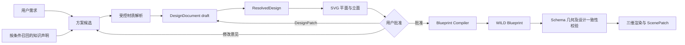

# 9 月 9 日优化：建筑设计契约链路

本目录定义 WildAgent 从“知识驱动生成”升级为“设计契约驱动编译”的统一规范。核心目标是让用户在生成 Blueprint 前看见并批准具体建筑设计，同时让知识规则具有明确适用条件和程序执行位置。

## 文档索引

1. [建筑设计文档与生成链路规范](01-建筑设计文档与生成链路规范.md)：权威数据层、状态流转、SVG 审阅、DesignPatch 和 Blueprint 编译关系。
2. [知识声明加工与执行规范](02-知识声明加工与执行规范.md)：将建筑长文拆成可验证声明，区分硬规则、条件关系、偏好、参考和未支持能力。
3. [实施范围与验收规范](03-实施范围与验收规范.md)：代码映射、兼容边界、测试矩阵和完成标准。
4. [DesignDocument JSON Schema](design-document.schema.json)：由后端 Pydantic 契约生成的机器可读字段规范。

## 核心决策

- `DesignDocument` 是建筑设计阶段唯一权威数据；`ResolvedDesign` 和 SVG 是可重复生成的派生结果；Blueprint 是批准设计的编译产物。
- 执行计划说明 Agent “怎样完成任务”，建筑设计审核确认“具体建成什么样”，两种审核不能混用。
- 用户在设计阶段通过 `DesignPatch` 或自然语言反馈修改 DesignDocument；Blueprint 生成后继续使用 `ScenePatch` 做构件级修改。
- 任何硬规则必须有 Schema、resolver、compiler 或 validator 的执行位置。只写进知识文档或提示词不算实施。
- 建筑类型卡只补充真正不同的身份和条件，不复制墙、门、窗、幕墙等共享系统规则。

## 数据流

具体知识库内容边界继续遵守 [知识库优化设计思路](../rag/知识库优化设计思路.md) 和 [rules-v2 实施说明](../rag/KNOWLEDGE_RULES_V2.md)。
