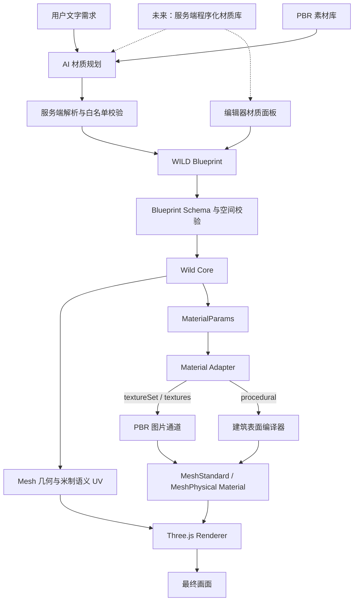
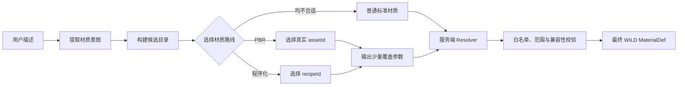

# WILD 建筑表面系统：渲染、程序化材质与 PBR 关系总览

## 1. 文档目的

本文统一解释 WILD 项目中以下概念的关系：

- WILD Blueprint；
- Wild Core；
- Three.js 渲染器；
- PBR 图片素材；
- 程序化材质；
- 建筑表面编译器；
- AI 材质规划；
- 用户素材库和材质复用。

本文同时区分“当前已经实现的能力”和“建议的后续架构”。阅读时不要把目标方案误认为已经上线的功能。

更详细的红砖 Shader、参数范围和测试设计见[《WILD 程序化建筑材质扩展方案》](./PROCEDURAL_MATERIALS.md)，正式 Blueprint 字段约束见[《WILD Blueprint 规范》](./WILD_BLUEPRINT_SPEC.md)。

## 2. 最重要的结论

程序化材质系统不是第二套完整渲染引擎。

Three.js 仍然是项目中负责 WebGL 绘制、灯光、阴影、雾、环境反射和色调映射的渲染引擎。程序化材质系统只负责根据受控参数计算建筑表面的颜色、粗糙度、金属度和法线，因此更准确的名称是：

> 建筑表面编译器（Architectural Surface Compiler）

它处于 Wild Core 和 Three.js 之间，但不会接管几何、碰撞、相机或场景管理。

```text
WILD Blueprint
    ↓
Wild Core：确定性几何、语义 UV、材质参数
    ↓
建筑表面编译器：把受控材质配方转换成固定 Shader 模块
    ↓
Three.js：标准 PBR 光照、阴影、环境和最终绘制
```

## 3. 系统全景关系



### 3.1 每个模块只负责什么

| 模块 | 主要职责 | 明确不负责 |
|---|---|---|
| WILD Blueprint | 保存几何、材质意图、资产引用和交互参数 | 不保存任意 Shader 代码 |
| 后端校验器 | 校验字段、范围、引用闭合和危险输入 | 不生成视觉纹理 |
| Wild Core | 生成确定性几何、UV、材质参数和诊断 | 不执行 WebGL Shader |
| Material Adapter | 将 Core 参数转换为 Three.js 材质并管理缓存 | 不决定建筑审美 |
| 建筑表面编译器 | 将受控配方组合成表面计算逻辑 | 不修改结构和碰撞 |
| Three.js Renderer | 灯光、阴影、反射、雾、相机和最终绘制 | 不理解建筑业务语义 |
| AI 材质规划 | 选择已有资产或有限材质配方 | 不生成 URL、GLSL 或未知字段 |
| 编辑器 | 供用户选择、调参、保存、应用和复用 | 不直接篡改 Three.js Material |

## 4. 当前已经实现到什么程度

截至 2026-08-13，项目当前状态如下：

| 能力 | 当前状态 |
|---|---|
| Three.js 标准/物理材质 | 已实现，负责普通 PBR、玻璃、清漆和织物等渲染 |
| PBR 图片素材入库 | 已实现；一张 Base Color 即可入库，Normal、Roughness 等为可选增强 |
| PBR 用户复用 | 已实现服务端素材库，可搜索、应用和移除 |
| AI 选择 PBR 素材 | 已实现；AI 只可选择服务端真实存在且角色匹配的资产 ID |
| 程序化材质协议 | 已实现第一版判别协议 |
| 程序化材质类型 | 当前只实现 `procedural.type = "brick"` |
| 红砖外观 | 已实现错缝、砖缝、程序化法线、色差、粗糙度变化、风化、盐碱、雨痕和墙脚受潮 |
| 红砖预设 | 已实现新红砖、自然旧红砖、潮湿盐碱红砖三套参数预设；三者共用同一 Shader |
| 自定义程序化材质复用 | 已实现当前 Blueprint 保存和同一浏览器本地复用 |
| AI 生成红砖参数 | 已实现；已有材质规划节点可主动选择内置预设和语义等级，服务端展开稳定 Shader 参数；旧式完整参数仍兼容 |
| PBR 与程序化混合 | 尚未实现；当前协议明确互斥 |
| 通用 `pattern + substrate + weathering` 编译器 | 建议的下一阶段目标，尚未全部实现 |
| 服务端程序化材质库 | 尚未实现；当前浏览器自定义配方不会自动进入 AI 可见目录 |

因此，当前红砖实现的主要价值是验证了以下完整链路：

```text
协议 → 校验 → Core 透传 → 缓存 → Shader → 编辑器 → AI 受控生成 → 自动测试
```

它是程序化建筑表面系统的第一个可交付类型，不代表最终只支持砖。

## 5. PBR、程序化材质与混合模式

PBR 图片材质和程序化 Shader 是两条材质来源路线，不是两套完整渲染引擎。两条路线最后都进入 Three.js 的标准/物理 PBR 材质，再由同一套灯光、阴影和环境系统绘制。

### 5.1 PBR 图片素材

PBR 图片材质以图片通道记录真实表面信息：

- Base Color：基础颜色；
- Normal：微小凹凸方向；
- Roughness：粗糙程度；
- Metalness：金属程度；
- Ambient Occlusion：局部遮蔽。

优势是扫描类材质真实、适用品类广；不足是受分辨率限制，大面积墙面可能出现重复，需要存储、授权和资产管理。

### 5.2 程序化材质

程序化材质不读取 PNG/JPEG/WebP，而是根据米制 UV、局部高度、随机种子和数学噪声实时计算表面。

优势包括：

- 理论上不受图片分辨率限制；
- 砖尺寸、板缝和老化程度可以精确参数化；
- 固定 seed 后可确定性重建；
- AI 只需输出少量受控参数；
- 大面积表面可以减少明显的图片平铺重复。

不足包括：

- 复杂自然纹理通常不如高质量扫描素材真实；
- 会增加 GPU Shader 运算；
- 需要稳定、连续且语义明确的 UV；
- 材质类别无限扩张时容易造成 Shader 和协议膨胀。

### 5.3 未来的显式混合模式

后续可以增加明确的三种模式：

| 模式 | 数据来源 | 适用场景 |
|---|---|---|
| `procedural` | 完全由程序化配方生成 | 红砖、规则板缝、参数化混凝土 |
| `pbr` | 完全使用图片资产 | 大理石、特殊木材、真实扫描表面 |
| `pbr_with_effects` | PBR 基础 + 程序化老化层 | 石材雨痕、金属锈蚀、墙脚受潮 |

当前版本禁止直接把 `procedural` 与 `textureSet/textures/embeddedImage` 混写。未来若实现混合，应使用独立的 `proceduralEffects` 字段，明确程序化层只调制图片材质，不产生覆盖顺序歧义。

### 5.4 两条路线的集中对比

| 对比项 | PBR 图片材质 | 程序化 Shader 材质 |
|---|---|---|
| WILD 入口 | `textureSet` 或兼容的 `textures` | `procedural` |
| 当前资产类型 | `kind=pbr_texture_set` | 当前直接保存材质配方，尚无服务端资产类型 |
| 数据来源 | Base Color、Normal、Roughness 等图片 | UV、局部高度、seed、尺寸和噪声函数 |
| 当前渲染底座 | `MeshStandardMaterial`；玻璃等使用 `MeshPhysicalMaterial` | 在 `MeshStandardMaterial` 上安装受控 `onBeforeCompile` Shader |
| 是否需要图片 | 至少需要 Base Color | 不需要任何图片 |
| 最适合 | 扫描石材、特殊木材、大理石、复杂花纹和真实表面 | 规则砖块、板缝、可控风化、大面积避免重复的建筑表面 |
| 主要调节参数 | 色彩、粗糙度、金属度、法线强度、UV 比例 | 单元尺寸、接缝、表面变化、风化、盐碱、雨痕、受潮 |
| 大面积重复 | 可能出现平铺痕迹 | 可用确定性噪声和米制排布降低重复感 |
| 细节真实性 | 高质量扫描素材通常更真实 | 规则和参数化效果更可控，复杂自然纹理有限 |
| 分辨率 | 受图片尺寸限制 | 数学生成，理论上不受图片像素限制 |
| 主要资源成本 | 显存、纹理带宽、文件存储 | GPU 像素计算和 Shader 复杂度 |
| 当前复用范围 | 服务端素材库，用户和 AI 都可复用 | 当前 Blueprint + 同一浏览器；AI 看不到用户 localStorage 配方 |
| 当前同材质混用 | 与 `procedural` 互斥 | 与图片通道互斥 |
| 同一项目共存 | 支持，不同构件可使用不同路线 | 支持，不同构件可使用不同路线 |

选择原则不是“程序化一定比 PBR 高级”，而是让两者各自处理擅长的问题：

- 有真实、匹配且授权明确的高质量图片素材时，优先使用 PBR；
- 用户要求精确分块尺寸、无图片、大面积无重复或可调老化时，优先使用程序化材质；
- 既没有合适图片，程序化系统也不支持该表面时，回退到普通颜色、粗糙度和金属度；
- 未来需要“真实图片 + 统一雨痕/受潮”时，使用显式 `pbr_with_effects`，不能让两个完整表面生成器无规则叠加。

同一建筑中的推荐组合示例：

```text
红砖主体墙       → 程序化 masonry/clay
入口天然石材     → PBR 石材素材
木门             → PBR 木材素材
铝合金窗框       → 普通金属 PBR 参数或未来 panel/metal
窗玻璃           → MeshPhysicalMaterial 物理玻璃
屋顶防水层       → PBR 素材或普通粗糙材质
```

## 6. 当前红砖 WILD 格式

元素通过 `material` 引用材质 ID：

```json
{
  "geometry": {
    "elements": [
      {
        "id": "wall_front",
        "type": "wall",
        "from": [0, 0, 0],
        "to": [6, 3, 0],
        "thickness": 0.24,
        "material": "brick_aged"
      }
    ],
    "components": []
  },
  "materials": {
    "brick_aged": {
      "baseColor": [0.52, 0.11, 0.055],
      "roughness": 0.84,
      "metallic": 0,
      "albedo": 1,
      "lightingCondition": "D65_noon",
      "procedural": {
        "type": "brick",
        "seed": 42,
        "brickSize": [0.24, 0.065],
        "mortarWidth": 0.01,
        "mortarDepth": 0.006,
        "bond": "running",
        "secondaryColor": [0.68, 0.19, 0.08],
        "colorVariation": 0.14,
        "roughnessVariation": 0.16,
        "edgeWear": 0.06,
        "weathering": {
          "amount": 0.28,
          "scale": 1.8,
          "efflorescence": 0.1,
          "verticalStreaks": 0.14,
          "baseDampness": 0.08
        }
      }
    }
  }
}
```

当前协议有以下关键约束：

- `type` 只允许 `brick`；
- `brickSize`、`mortarWidth`、`mortarDepth` 使用米；
- 变化强度和老化强度使用 `0–1`；
- `mortarWidth` 必须小于砖块短边的一半；
- Blueprint 不允许携带 GLSL 或其他可执行字段；
- `weathering.amount` 是老化总强度，为 `0` 时盐碱、雨痕和墙脚受潮基本不显示；
- 程序化材质只改变表面，不改变墙体几何、洞口、碰撞和轮廓。

## 7. 建议的通用建筑表面模型

后续不建议为每一种商品名或建筑风格增加一个完整 Shader。应把表面拆为三个正交维度：

### 7.1 Pattern：宏观排布

| 类型 | 负责内容 | 可复用材质 |
|---|---|---|
| `solid` | 无规则分块的连续表面 | 抹灰、水泥、涂料 |
| `masonry` | 单元格、错缝、灰缝和分块边缘 | 红砖、青砖、瓷砖、规则石墙 |
| `panel` | 大板分缝、面板编号和接缝 | 清水混凝土、石材幕墙、金属幕墙 |
| `plank` | 长条方向、板缝和错排 | 木饰面、木地板、部分条形金属板 |

### 7.2 Substrate：基础材料

| 类型 | 共享微观特征 | 典型用途 |
|---|---|---|
| `mineral` | 颗粒、气孔、矿物色斑、粉化 | 混凝土、抹灰、水泥、瓷砖坯体 |
| `clay` | 烧制色差、细颗粒、吸水变化 | 红砖、青砖、陶板 |
| `stone` | 矿物色差、颗粒或有限矿脉 | 石墙、石材板、铺地 |
| `wood` | 方向性木纹、年轮和色差 | 木板、门、木饰面 |
| `metal` | 金属度、拉丝方向和氧化响应 | 钢、铝、铜、金属幕墙 |

### 7.3 Weathering：通用环境老化

建议保持为固定字段集合，而不是允许任意长度、任意顺序的效果节点图：

- `amount`：老化总强度；
- `scale`：大尺度连续变化范围；
- `edgeWear`：边缘磨损；
- `efflorescence`：盐碱泛白；
- `verticalStreaks`：竖向雨痕；
- `baseDampness`：墙脚受潮；
- `moss`：苔藓；
- `rust`：锈蚀。

校验器需要限制不合理组合，例如 `rust` 只允许金属，明显盐碱主要适用于矿物、黏土和石材。

### 7.4 目标 WILD 配方示例

以下属于建议目标，并非当前正式协议：

```json
{
  "procedural": {
    "type": "architectural_surface",
    "version": 1,
    "seed": 42,
    "pattern": {
      "type": "masonry",
      "unitSize": [0.24, 0.065],
      "jointWidth": 0.01,
      "jointDepth": 0.006,
      "bond": "running"
    },
    "substrate": {
      "type": "clay",
      "secondaryColor": [0.68, 0.19, 0.08],
      "colorVariation": 0.14,
      "roughnessVariation": 0.16,
      "microDetail": 0.3
    },
    "weathering": {
      "amount": 0.28,
      "scale": 1.8,
      "edgeWear": 0.06,
      "efflorescence": 0.1,
      "verticalStreaks": 0.14,
      "baseDampness": 0.08,
      "moss": 0,
      "rust": 0
    }
  }
}
```

现有 `type=brick` 可以作为兼容别名，由 Core 归一化成 `pattern=masonry + substrate=clay`，避免旧文件失效。

## 8. 建筑表面编译器的内部设计

### 8.1 统一输入

所有模块共享同一份稳定上下文：

```ts
interface SurfaceContext {
  surfaceMeters: [number, number]
  localPosition: [number, number, number]
  worldPosition: [number, number, number]
  baseNormal: [number, number, number]
  seed: number
}
```

砖块排列和板缝优先使用米制墙面 UV，避免墙体旋转后方向改变；雨痕和墙脚潮湿可以有限使用局部高度或世界高度。

### 8.2 统一输出

每个模块最终只修改统一的 PBR 表面样本：

```ts
interface SurfaceSample {
  color: [number, number, number]
  roughness: number
  metallic: number
  height: number
}
```

其中 `height` 只用于计算程序化法线，第一阶段不进行顶点位移，因此不会改变碰撞和墙体轮廓。

### 8.3 固定编译顺序

```text
创建基础 SurfaceSample
    ↓
Pattern 计算单元、接缝和边缘遮罩
    ↓
Substrate 计算颜色、粗糙度和微观高度
    ↓
Weathering 根据高度、方向和连续噪声调制表面
    ↓
Height 导数转换为法线
    ↓
交给 MeshStandardMaterial 的标准光照流程
```

不开放任意节点图、任意循环或 Blueprint 自定义 Shader。所有可用模块必须在前端可信注册表中预先实现。

## 9. 缓存与性能规则

程序化材质至少涉及两层缓存：

### 9.1 Material 实例缓存

材质参数签名必须包含完整的规范化配方。砖尺寸、颜色或风化强度改变时，需要得到新的 Material 实例和 uniform 值。

### 9.2 GPU Program 缓存

GPU Program key 只记录会改变 Shader 结构的模块组合，例如：

```text
architectural-v1:masonry:clay:weathering
```

以下变化不应重新编译 GPU Program：

- 颜色变化；
- 砖块或板块尺寸；
- 随机种子；
- 风化、盐碱和雨痕强度；
- 粗糙度变化。

这些都应该作为 uniform。这样大量墙体可以使用不同参数，但仍共享有限数量的 GPU Program。

### 9.3 防止组合爆炸

- `pattern`、`substrate` 使用有限枚举；
- 同一配方只能选择一个 pattern 和一个 substrate；
- weathering 使用固定结构，不允许任意效果数组；
- 不为每个预设生成 Shader；
- 预设只是参数数据；
- 新模块必须证明无法由现有模块组合表达。

## 10. 素材库、编辑器和 AI 的复用关系

### 10.1 当前 PBR 素材流程

```text
用户上传 Base Color 和可选专业通道
    ↓
服务端生成内容寻址的 PBR assetId
    ↓
素材库保存文件、哈希、授权、标签和推荐角色
    ↓
用户可以再次选择应用
    ↓
AI 只看到精简目录并选择真实存在的 assetId
```

### 10.2 当前程序化材质流程

```text
用户选择内置预设或调节参数
    ↓
ScenePatch 写入当前 Blueprint
    ↓
同一浏览器 localStorage 保存“我的材质”
```

该方式可以满足当前用户手动跨项目复用，但存在边界：

- 换浏览器或设备后不会同步；
- 服务端 AI 看不到浏览器 localStorage；
- 不能像 PBR 素材一样统一搜索、授权和分类。

### 10.3 建议的统一服务端材质库

程序化配方最终应作为另一种资产类型保存：

```json
{
  "assetId": "proc_0123456789abcdef01234567",
  "kind": "procedural_material",
  "name": "潮湿旧红砖",
  "classification": {
    "materialClass": "brick",
    "tags": ["red_brick", "weathered", "efflorescence"],
    "recommendedRoles": ["facade_primary"]
  },
  "recipe": {
    "pattern": {},
    "substrate": {},
    "weathering": {}
  }
}
```

统一后应满足：

- 用户可跨项目、跨设备复用；
- 用户可以从材质库删除记录；
- 已有 Blueprint 内保留配方快照，不因素材库删除而失效；
- AI 只读取名称、标签、适用角色等精简目录；
- AI 只能引用真实存在的 ID；
- 服务端根据 ID 展开完整配方并再次校验。

## 11. AI 的正确职责

AI 不应该决定 Shader 实现，而只负责选择意图：

```text
用户：“外墙使用有轻微盐碱的旧红砖”
    ↓
AI：选择“自然旧红砖”预设或输出有限参数
    ↓
服务端：检查类型、字段、范围、角色和资产 ID
    ↓
Blueprint：保存合法材质定义
    ↓
Renderer：使用固定可信 Shader 实现
```

AI 输出必须满足：

- 不输出 GLSL；
- 不输出纹理 URL；
- 不猜测素材 ID；
- 不创建未知 pattern/substrate/effect；
- 参数越界由服务端裁剪或拒绝；
- PBR 与程序化配方的优先级由协议确定，不由模型自由解释。

为了降低模型出错率，优先让 AI 选择“预设 ID + 少量覆盖参数”，而不是每次生成完整配方。

### 11.1 当前已经实现的 AI 路线

自动丰富不新增独立 LangGraph 节点。现有 `material_plan` 本来就位于 `architecture` 和 `skeleton` 之间，已经拥有建筑方案、用户原始需求和素材目录；在这一节点内完成材质叙事、路线选择和 Shader 语义参数最符合单一职责。另建“语言丰富节点”会重复读取同一上下文、增加一次模型调用，并扩大重试与状态合并的失败面。

当前材质规划节点会接收：

- 用户原始需求；
- 已批准的建筑方案；
- 服务端真实存在的 PBR 素材精简目录；
- 固定的角色列表和材质协议约束。

模型为 `facade_primary/structure/floor/frame/door/glass/roof` 等角色输出材质意图。当前行为是：

- PBR 路线输出真实 `assetId`，服务端检查资产是否存在、是否适合该角色；
- 用户明确要求无贴图红砖、砖缝、盐碱或风化时，外墙角色可以输出 `procedural.type=brick` 和有限参数；
- 服务端删除未知字段、限制数值范围，并保证 PBR 资产优先于同一角色中冲突的程序化参数；
- 最终由服务端把解析后的材质写进 Blueprint，AI 不能直接控制 Shader。

当前三套红砖预设已同时进入编辑器和服务端受控目录。材质规划 AI 可以输出 `proceduralPresetId + shaderAdjustments`，由服务端进行等级映射、参数依赖处理和稳定 seed 生成；旧式完整 `procedural` 参数仍保留兼容。用户保存在浏览器中的自定义配方尚未进入服务端，因此 AI 当前只能自动选择内置预设和服务端 PBR 素材。

### 11.2 推荐的 AI 自动材质生成管线

目标流程应该分成“理解、选择、少量调参、确定性展开”四步：



#### 第一步：提取材质意图

AI 先把自然语言整理成有限业务维度，而不是立刻生成 WILD：

| 维度 | 示例 |
|---|---|
| 建筑角色 | `facade_primary`、`roof`、`door`、`frame` |
| 材质家族 | 砖、混凝土、石材、木材、金属、玻璃 |
| 排布需求 | 连续、砌块、面板、长条 |
| 真实感来源 | 指定素材、扫描质感、无贴图、可参数化 |
| 环境状态 | 新、轻微风化、潮湿、盐碱、锈蚀 |
| 明确数值 | 砖宽 240mm、灰缝 10mm、法线强度 1.2 |
| 约束词 | 不要贴图、必须使用我的素材、保持干净、不要锈蚀 |

否定词必须保留。例如“不要风化”不能因为知识库认为旧砖通常有风化就被覆盖。

#### 第二步：构建可信候选目录

候选只能来自三个可信来源：

1. 服务端真实存在的 PBR 资产目录；
2. 代码版本固定的内置程序化预设目录；
3. 未来服务端保存的用户程序化材质目录。

每个候选只向 AI 暴露选择所需的精简信息：

```json
{
  "id": "builtin:brick_aged_red:v1",
  "kind": "procedural_material",
  "name": "自然旧红砖",
  "materialClass": "brick",
  "tags": ["red_brick", "weathered"],
  "recommendedRoles": ["facade_primary"],
  "supportedOverrides": ["colorTone", "weatheringLevel", "efflorescenceLevel"]
}
```

不把纹理 URL、完整 Shader、任意代码或无关资产交给模型。

#### 第三步：选择 PBR 或程序化路线

推荐使用以下确定性优先级，而不是完全依赖模型自由判断：

```text
用户明确指定素材 ID
    → 使用该 PBR/程序化资产，前提是存在且角色兼容

用户明确说“无贴图”、给出砖/板尺寸或要求可调分缝
    → 有受支持配方时选择程序化路线

存在高匹配度 PBR 资产，且用户强调扫描、天然纹理或指定图片质感
    → 选择 PBR

没有合适 PBR，但程序化模块能够表达需求
    → 选择程序化路线

两条路线都不能可靠表达
    → 回退普通标准材质，不猜测资产和类型
```

AI 可以参与语义匹配和候选排序，但“资产是否存在、角色是否兼容、类型是否实现”必须由代码做最终决定。

#### 第四步：只生成少量覆盖参数

建议的 AI 中间输出不是完整 WILD，而是窄协议。例如程序化材质：

```json
{
  "role": "facade_primary",
  "route": "procedural",
  "recipeId": "builtin:brick_aged_red:v1",
  "overrides": {
    "weatheringLevel": "subtle",
    "efflorescenceLevel": "subtle",
    "baseDampnessLevel": "none"
  }
}
```

PBR 材质：

```json
{
  "role": "entrance_accent",
  "route": "pbr",
  "assetId": "pbr_0123456789abcdef01234567",
  "overrides": {
    "normalStrength": "medium",
    "colorTint": [0.96, 0.94, 0.9]
  }
}
```

服务端再把等级词映射成固定数值。例如以下只是可版本化的映射示例：

| 等级 | 建议数值 |
|---|---:|
| `none` | `0` |
| `subtle` | `0.12` |
| `moderate` | `0.30` |
| `strong` | `0.55` |

这样“轻微盐碱”不会因为不同模型或不同轮次随机变成 `0.08/0.35/0.7`。映射值由代码和视觉回归确定，模型只选择语义等级。

### 11.3 参数来源与优先级

最终参数应按以下优先级合并，越靠前优先级越高：

```text
用户明确给出的合法数值
    ↓
用户明确选择的素材或配方
    ↓
AI 输出的有限语义覆盖项
    ↓
素材/预设自身默认值
    ↓
协议默认值
```

具体规则：

- 用户说“砖宽 240mm”，应确定性转换为 `0.24m`，不能被预设覆盖；
- 用户只说“轻微风化”，AI 输出 `weatheringLevel=subtle`，服务端映射数值；
- 用户没有提砖尺寸时，使用配方默认值或经过验证的知识值，不让模型随意猜测；
- PBR 的真实尺寸、默认法线强度和通道信息来自资产清单，不让 AI 重写；
- `seed` 应由服务端根据材质 ID、配方 ID和场景稳定标识生成或使用预设值，不依赖模型随机输出；
- 所有颜色、强度、尺寸在写入 Blueprint 前再次校验。

### 11.4 服务端 Resolver 的职责

Resolver 是 AI 与最终 WILD 之间的确定性防线，至少执行：

1. 检查 `route` 是否为实现过的枚举；
2. 检查 `assetId/recipeId` 是否真实存在；
3. 检查材质是否允许用于目标建筑角色；
4. 加载可信资产默认值或程序化预设；
5. 只应用该候选声明支持的 override；
6. 将语义等级转换为版本固定的数值；
7. 应用用户明确数值并进行单位转换；
8. 校验范围、互斥、材质家族与老化效果兼容性；
9. 生成完整、闭合、可直接渲染的 `MaterialDef`；
10. 记录选择来源和回退原因，便于失败案例追踪。

模型输出失败、资产被删除或配方不兼容时，Resolver 应按固定规则回退，而不是再次让模型无限重试：

```text
指定资产失效
    → 同类可信候选
    → 受支持程序化预设
    → 普通标准材质
```

### 11.5 用户自定义材质如何让 AI 自动调用

当前 PBR 用户素材保存在服务端，AI 能读取精简目录并自动选择。当前自定义程序化材质只保存在浏览器 `localStorage`，因此服务端 AI 无法看到。

要让 AI 自动调用用户以前保存的程序化参数，需要完成以下闭环：

```text
用户保存程序化配方
    ↓
服务端生成 proc_* 资产 ID
    ↓
保存名称、标签、推荐角色、协议版本和完整配方
    ↓
材质规划时只给 AI 精简候选目录
    ↓
AI 输出真实 recipeId + 少量覆盖项
    ↓
服务端展开配方并写入 Blueprint 快照
```

删除素材库记录时，已有 Blueprint 中的配方快照仍然保留，避免旧项目失效；只是后续 AI 不能再把已删除资产作为新候选。

### 11.6 如何用失败案例持续改进 AI，而不膨胀代码

每个失败案例先归入有限类别，再决定修复层：

| 失败类别 | 通用修复位置 |
|---|---|
| 选错 PBR/程序化路线 | 决策规则、候选标签或评分阈值 |
| 选择不存在的资产 | Resolver 引用闭合校验 |
| 参数过强或不稳定 | 语义等级映射和参数上限 |
| 明确用户数值被覆盖 | 参数优先级和单位解析 |
| 效果与材质不兼容 | substrate/effect 兼容矩阵 |
| 同一请求每次结果差异过大 | 预设选择、固定 seed 和确定性展开 |
| 材质正确但画面错误 | UV 契约、Shader 模块或渲染回归 |

只有当失败无法映射到现有类别，并且至少代表一种可复用的材质规律时，才增加新模块或新规则。不得按建筑 ID、墙体 ID、用户句子或单次生成结果写特例。

### 11.7 Shader 自动参数生成器（重点）

Shader 自动参数的正确思路不是让 AI 直接编写 GLSL，也不是让 AI 每次从零猜十几个浮点数，而是建立一层独立的 `ShaderParameterResolver`：

```text
用户自然语言
    ↓
AI 输出有限的表面语义
    ↓
选择经过视觉验收的基础预设
    ↓
代码把语义等级映射为固定数值
    ↓
处理参数依赖、范围和单位
    ↓
生成完整 procedural 配方
    ↓
Renderer 转换为 Shader uniform
```

AI 负责理解“想要什么感觉”，Resolver 负责决定“具体使用什么安全数值”。

#### A. AI 应该输出表面意图，不输出 Shader 代码

例如用户说：

> 外墙使用偏暗的旧红砖，有一点盐碱和雨痕，砖缝稍微深一些，不要显得特别脏。

AI 的推荐中间输出：

```json
{
  "surfaceType": "brick",
  "presetId": "builtin:brick_aged_red:v1",
  "tone": "dark",
  "colorVariationLevel": "moderate",
  "mortarDepthLevel": "medium",
  "weatheringLevel": "moderate",
  "efflorescenceLevel": "subtle",
  "verticalStreaksLevel": "subtle",
  "baseDampnessLevel": "none",
  "constraints": ["avoid_dirty_appearance"]
}
```

这份中间数据不包含 GLSL、循环、函数或任意 uniform 名称。AI 只能使用协议提供的枚举。

#### B. 参数分为四组，来源不能混乱

| 参数组 | 当前红砖字段 | 推荐来源 |
|---|---|---|
| 物理规格 | `brickSize/mortarWidth/mortarDepth/bond` | 用户明确尺寸 > 建筑知识/标准规格 > 预设默认值 |
| 表面色差 | `baseColor/secondaryColor/colorVariation` | 用户色彩要求 + 已批准建筑色板 + 预设 |
| 微表面 | `roughness/roughnessVariation/edgeWear` | 材质家族预设 + 语义等级覆盖 |
| 环境老化 | `weathering.amount/scale/efflorescence/verticalStreaks/baseDampness` | 环境描述 + 老化预设 + 兼容规则 |

“轻微、明显、整齐、粗糙”等形容词可以控制强度，但不能用来猜物理尺寸。例如“粗犷红砖”可以提高粗糙度和色差，但不能擅自把标准砖宽改成 0.5m。

#### C. 使用版本固定的等级映射

建议把常见强度词先归一化为有限等级：

```text
无、不要、干净       → none
一点、轻微、少量     → subtle
自然、适中、明显一些 → moderate
强烈、严重、重度     → strong
```

然后由代码映射数值。不同字段可以使用不同映射表，不能简单地让所有 `subtle` 都等于同一个数字。例如：

```ts
const SHADER_PARAMETER_LEVELS = {
  colorVariation: { none: 0, subtle: 0.08, moderate: 0.14, strong: 0.22 },
  roughnessVariation: { none: 0, subtle: 0.08, moderate: 0.16, strong: 0.24 },
  edgeWear: { none: 0, subtle: 0.025, moderate: 0.06, strong: 0.1 },
  weatheringAmount: { none: 0, subtle: 0.12, moderate: 0.28, strong: 0.48 },
  efflorescence: { none: 0, subtle: 0.1, moderate: 0.24, strong: 0.46 },
  verticalStreaks: { none: 0, subtle: 0.08, moderate: 0.16, strong: 0.28 },
  baseDampness: { none: 0, subtle: 0.08, moderate: 0.2, strong: 0.34 }
}
```

这些数值不是永远不变的行业标准，而是项目经过固定灯光、相机和材质视觉回归后确定的版本化默认值。修改映射需要更新版本和截图基准，不能随着提示词临时变化。

#### D. 基础预设决定合理起点

当前三套红砖预设可以作为第一版自动参数的基础：

| 识别到的用户语义 | 基础预设 | 主要默认参数 |
|---|---|---|
| 新、整齐、干净、刚砌好 | 新红砖 | 低色差、低边缘磨损、基本无盐碱 |
| 旧、自然风化、有年代感 | 自然旧红砖 | 中等风化、少量流痕和磨损 |
| 潮湿、返碱、墙脚发黑 | 潮湿盐碱红砖 | 较强盐碱、流痕和墙脚受潮 |

AI 先选择最接近的预设，只对用户明确提到的维度进行覆盖。用户没有提到的字段保留预设值，避免生成互相矛盾的随机参数。

例如“干净的新红砖，但砖色有一点变化”：

```text
基础预设     = 新红砖
colorVariation = subtle
weathering     = none
efflorescence  = none
baseDampness   = none
其他字段       = 保留预设
```

#### E. 明确数值由确定性解析器优先处理

用户给出具体数值时，不需要 AI 猜测：

```text
“砖宽 240mm”       → brickSize[0] = 0.24
“砖高 65mm”        → brickSize[1] = 0.065
“灰缝 10mm”        → mortarWidth = 0.01
“凹陷 6mm”         → mortarDepth = 0.006
“使用齐缝”         → bond = stack
```

数值和单位应先由确定性文本解析器提取，再交给 AI 补充未明确的审美意图。最终优先级为：

```text
用户明确数值 > 用户选择的预设 > AI 语义覆盖 > 预设默认值 > 协议默认值
```

#### F. Resolver 必须处理参数依赖

单个字段合法不代表组合后合理。生成最终 Shader 参数前至少处理：

- `mortarWidth < min(brickSize) / 2`；
- `mortarWidth <= 0.03m`；
- `mortarDepth <= 0.02m`；
- 盐碱、流痕或墙脚受潮大于零时，`weathering.amount` 不能为零；
- “保持干净”应限制 weathering、efflorescence、streaks 和 dampness 的总上限；
- `secondaryColor` 与 `baseColor` 的差距需要受控，避免变成杂色墙；
- `roughnessVariation` 不能把最终粗糙度推到物理范围之外；
- 不适用于当前 substrate 的效果必须被拒绝，例如未来木材不能直接套用盐碱规则；
- 程序化配方和图片 PBR 在当前协议中继续互斥。

依赖处理必须集中在 Resolver 和通用 validator，不在某栋建筑的生成节点中打补丁。

#### G. seed 不应该由 AI 随机编造

为了让相同项目每次重建一致，建议由服务端生成稳定 seed：

```text
seed = stableHash(projectId + materialId + recipeVersion) % 2147483647
```

用户明确指定 seed 时可以保留；否则不要让模型每次随意输出不同数字。这样重试生成、重新打开项目或模板复用时，表面噪声不会跳动。

#### H. 生成完整 WILD，再转换为 uniform

上面的“偏暗旧红砖、少量盐碱和雨痕”经过 Resolver 后，可以得到：

```json
{
  "baseColor": [0.46, 0.095, 0.045],
  "roughness": 0.84,
  "metallic": 0,
  "albedo": 1,
  "lightingCondition": "D65_noon",
  "procedural": {
    "type": "brick",
    "seed": 1384057,
    "brickSize": [0.24, 0.065],
    "mortarWidth": 0.01,
    "mortarDepth": 0.009,
    "bond": "running",
    "secondaryColor": [0.59, 0.15, 0.06],
    "colorVariation": 0.14,
    "roughnessVariation": 0.16,
    "edgeWear": 0.06,
    "weathering": {
      "amount": 0.28,
      "scale": 1.8,
      "efflorescence": 0.1,
      "verticalStreaks": 0.08,
      "baseDampness": 0
    }
  }
}
```

Renderer 不再理解“轻微”“旧”“不要太脏”等自然语言，只读取已经闭合的数值，并转换为 `wildBrickSize/wildMortarDepth/wildWeatherAmount` 等 uniform。

#### I. 当前实现与下一步改造

| 环节 | 当前实现 | 推荐下一步 |
|---|---|---|
| AI 输出 | 已支持 `proceduralPresetId + shaderAdjustments`，并兼容完整受控 `brick` 参数 | 增加更多建筑表面类型的同类窄协议 |
| 参数校验 | 已有白名单、范围、图片互斥、等级映射、清洁度上限和老化总开关依赖 | 随 substrate 扩展材质兼容矩阵 |
| 默认值 | 已有服务端版本化红砖配方，Core 和 renderer 继续防御性补默认值 | 后续让前后端从同一服务端配方目录读取，消除数据副本 |
| seed | 内置配方由服务端按建筑方案、请求和配方生成稳定 hash；旧完整参数仍兼容显式 seed | 用户保存配方时加入稳定项目/资产标识策略 |
| 用户复用 | 浏览器 localStorage | 服务端 `procedural_material` 资产库 |
| AI 复用 | 能选择内置 `presetId`，看不到用户本地配方 | 用户配方入服务端后选择真实 `recipeId` |
| 回归 | 已有协议、Core 和 Shader 自动测试 | 增加自然语言意图到最终参数的表格驱动测试 |

建议增加表格驱动测试，不调用真实模型也能验证 Resolver：

| 输入意图 | 必须得到 | 必须避免 |
|---|---|---|
| 干净新红砖 | 新红砖、低色差、无盐碱 | 自动增加潮湿和重度风化 |
| 轻微盐碱旧红砖 | 旧红砖、低盐碱、中等总风化 | `amount=0` 导致盐碱实际不显示 |
| 砖宽 240mm、灰缝 10mm | `0.24/0.01m` | 单位未转换或被预设覆盖 |
| 砖缝深一点但不要脏 | 只提高 mortarDepth，限制老化 | 把“深”误判成颜色变暗或重度受潮 |
| 使用我的潮湿旧砖 | 真实 recipeId 和合法覆盖项 | 猜测不存在的用户配方 ID |

## 12. 编辑器交互原则

编辑器应该围绕“选择、预设、有限调参、保存、复用”设计：

1. 用户在视口使用 Ctrl + 左键多选构件；
2. 在材质面板选择 PBR 素材或程序化预设；
3. 高级面板只显示当前类型支持的有限参数；
4. 点击应用后生成 ScenePatch；
5. ScenePatch 同时写入材质定义和全部已选对象的材质引用；
6. 所有修改进入历史记录，支持撤销和重做；
7. 编辑器不直接修改 Three.js Material，Blueprint 始终是事实源。

未来编辑器可把目标模型分为三个区域：

- 排布：砖、板、木条的规格和接缝；
- 表面：材质类别、颜色、颗粒和粗糙度；
- 老化：风化、盐碱、雨痕、受潮、苔藓和锈蚀。

## 13. 新材质能力的准入规则

为了避免代码随着建筑或材质数量线性增长，新增代码前必须回答以下问题：

1. 这是某一个建筑的特例，还是多个建筑会遇到的共性？
2. 能否通过已有 pattern、substrate 或 weathering 参数表达？
3. 如果不能，它缺少的是新的共性模块，还是只缺一套预设？
4. 新模块是否至少能服务两个以上明确场景？
5. 是否可以与现有噪声、UV、法线、缓存和验证基础设施复用？
6. 是否增加了新的 Shader 结构组合？若增加，能否控制 Program 数量？
7. 是否有独立的协议、后端、Core、renderer 和视觉回归测试？

以下情况通常只应增加预设，不应增加代码：

- 砖的颜色不同；
- 风化程度不同；
- 砖块或板块尺寸不同；
- 盐碱、雨痕、潮湿强度不同；
- 随机种子不同。

以下情况才可能需要新增模块：

- 从连续表面变成规则砌块或大板分缝；
- 从各向同性颗粒变成有方向的木纹或拉丝；
- 从非金属矿物表面变成需要金属氧化规律的表面。

## 14. 推荐实施顺序

### 阶段 1：保持红砖外观不变，先重构内部

- 把当前 `brick` Shader 拆为共享噪声、masonry 排布、clay 表面和 weathering；
- 继续接受旧 `type=brick`；
- 保证重构前后固定 seed 的视觉结果基本一致；
- 不在这一阶段新增大量新参数。

### 阶段 2：增加矿物连续表面

- 实现 `solid + mineral`：抹灰、水泥；
- 实现 `panel + mineral`：清水混凝土、模板分缝；
- 复用已有风化、雨痕和墙脚受潮；
- 增加混凝土和抹灰预设，而不是复制 Shader。

### 阶段 3：扩展有限排布组合

- `masonry + stone`：规则石墙；
- `masonry + mineral`：瓷砖；
- `plank + wood`：木饰面；
- `panel + metal`：金属幕墙。

### 阶段 4：统一程序化材质资产库

- 新增 `procedural_material` 资产清单；
- 支持服务端保存、查询和删除；
- 将程序化材质精简目录交给 AI；
- Blueprint 保存解析后的配方快照。

### 阶段 5：显式 PBR 老化层

- 增加 `proceduralEffects`；
- 只允许通用老化调制，不允许程序化 pattern 覆盖图片；
- 补充 PBR + 雨痕、锈蚀、墙脚潮湿的组合测试；
- 根据真实 GPU 数据决定是否加入质量档位和距离 LOD。

## 15. 测试与验收矩阵

### 15.1 协议与安全

- 合法类型与参数通过；
- 未知类型、字段、布尔数值、NaN 和无穷大被拒绝；
- 非法模块组合产生明确路径错误；
- Blueprint 不能携带 Shader 源码；
- 资产引用必须闭合。

### 15.2 Core

- 配方归一化结果确定；
- 不修改源 Blueprint；
- 米制 UV 在不同尺寸墙体上保持相同比例；
- 旧 `brick` 能迁移到新内部配方；
- 材质变化不触发不必要的几何重建。

### 15.3 Renderer

- 每种 pattern/substrate 组合能够正确安装固定 Shader；
- 数值变化产生新 Material uniform，但不产生新 GPU Program；
- 未知类型安全回退；
- 材质缓存清理时统一 dispose；
- 普通 PBR、玻璃和历史材质不受影响。

### 15.4 视觉

建立有限的测试矩阵，不为每栋建筑保存一套用例：

- 直墙、带洞墙、曲墙和多层模板墙；
- `solid/masonry/panel/plank` 四种排布；
- 近、中、远三个固定相机距离；
- 斜光、阴天环境光两种固定照明；
- 固定 seed 的基准截图；
- 检查 UV 拉伸、接缝、摩尔纹、闪烁和法线方向。

### 15.5 性能

- 记录普通 PBR 与程序化材质的 GPU 帧耗差异；
- 检查 Material 和 Program 数量；
- 相同模块组合不得因数值不同重复编译 Program；
- 连续观察时材质和 Program 数量不得持续增长；
- 根据数据决定是否需要质量档位或 LOD，不提前增加复杂度。

## 16. 当前相关代码位置

| 位置 | 作用 |
|---|---|
| `wild-web/src/wild-core/types.ts` | WILD/Core 程序化材质类型 |
| `wild-web/src/wild-core/src/primitive/materials/apply.ts` | Core 默认值、归一化和只读透传 |
| `wild-server/app/utils/blueprint_parser.py` | 后端协议和范围校验 |
| `wild-web/src/renderer/materialAdapter.ts` | Three.js 材质创建与缓存入口 |
| `wild-web/src/renderer/proceduralMaterials/` | 当前程序化红砖 Shader 和共享噪声 |
| `wild-web/src/components/panels/ProceduralMaterialPanel.vue` | 内置预设、自定义参数和浏览器复用入口 |
| `wild-web/src/wild/proceduralMaterialPresets.ts` | 当前三套红砖数据预设 |
| `wild-server/app/agent/nodes/material_plan_node.py` | AI 材质意图的受控解析 |
| `wild-server/app/agent/prompts.py` | AI 可输出字段和边界说明 |
| `wild-web/scripts/check-wild-core.mjs` | Core 程序化材质回归 |
| `wild-web/scripts/check-rendering-pipeline.mjs` | Shader、缓存和 Program key 回归 |

## 17. 一句话总结

WILD 只描述材质意图，Wild Core 提供确定性几何和米制表面坐标，建筑表面编译器把有限的排布、基础材质与老化参数组合成可信 Shader，最后仍由 Three.js 完成标准 PBR 渲染；PBR 图片素材与程序化材质互补，而不是互相替代。

扩展时应让代码跟有限的共性模块增长，让预设和用户资产以数据形式增长，绝不能让代码跟建筑数量、材质名称或失败案例数量线性增长。
