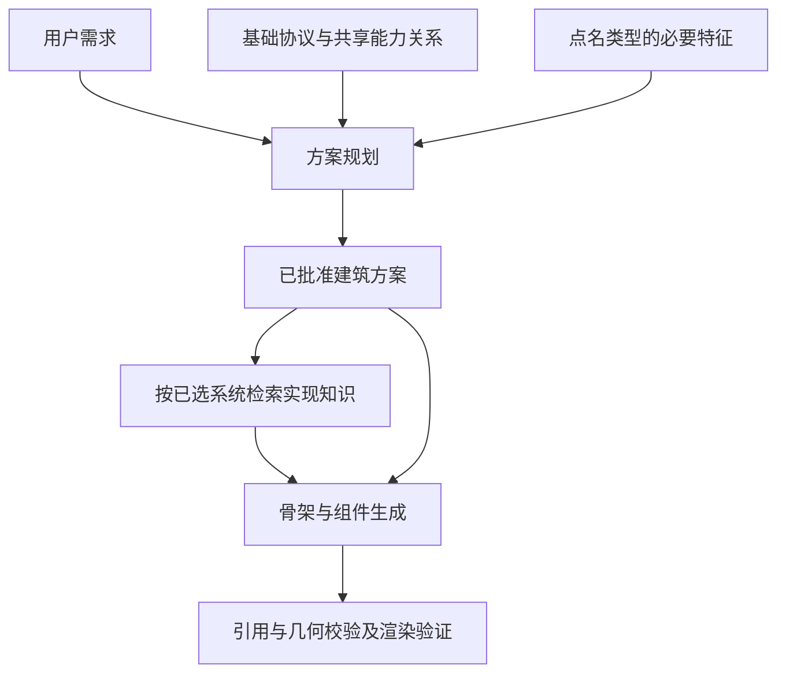

# 知识库优化设计思路

WildAgent 的知识库应当帮助模型把本次设计正确表达为 WILD，而不是提前替模型选好一栋建筑。优化后的核心分工是：**用户和建筑方案决定“建什么、长什么样”，知识库说明“当前系统能怎么表达、各部分怎样正确连接”。**

本文解释设计取舍；具体文件、metadata、同步命令和验收流程以 [rules-v2 实施说明](KNOWLEDGE_RULES_V2.md) 为准。

## 一、原来的问题在哪里

原库混合了建筑百科、实现规则、风格建议和坐标完备的建筑实例。它们经过检索后一起进入提示词，模型很难分清哪些是必须遵守的引擎约束，哪些只是某个案例的选择。

例如，某篇别墅文档包含固定长宽、楼层、窗位、屋顶和材料。它被检回后，模型可能直接修改这份蓝图，而不再根据本次需求重新组织空间。多个请求反复遇到同一案例，就容易得到相似建筑。

代码也会强化这种倾向：如果精密模式默认提高体量数量，或风格名称自动触发阳台、凸窗、雨棚组合，即使删掉文档中的模板，生成结果仍可能固定。因此必须一起调整知识内容、检索方式、方案约束和扩库流程。

这是对固定化机制的判断；是否改善实际生成多样性，仍需重复生成评测验证。

## 二、知识库应该保留什么

不能简单理解为“模型已经知道的全部删除”。模型可能懂建筑常识，却不知道当前项目的字段、编译方式和实现限制。保留与否应看这条知识能否解决具体的实现歧义。

| 内容 | 处理原则 | 例子 |
|---|---|---|
| WILD 协议 | 保留并保证准确 | 坐标语义、合法字段、引用格式 |
| 当前构件能力 | 保留，以源码为依据 | 组件有哪些参数、需要什么宿主、哪些形式尚未实现 |
| 条件组装关系 | 保留并跨建筑复用 | 选择窗后如何依附墙体，选择多层后如何衔接楼板和楼梯 |
| 必要类型特征 | 按需保留 | 院落需要真实留空，不能被通用楼板和屋盖填满 |
| 普通百科与风格套话 | 无明确项目价值时精简或归档 | “现代建筑通常简洁”“别墅环境优美” |
| 完整实例与风格策略 | 与普通生成知识隔离 | 一栋坐标完备的别墅、固定白墙灰顶配方 |

局部 JSON 可以解释字段和引用，但不能以局部示例的名义附带整栋布局。无依据的精确数字改成数字范围，仍可能限制设计；尺寸范围也需要用户要求、引擎限制或明确来源作为依据。

## 三、是否需要给每一种建筑规定规则

不需要为每个建筑类型复制一整套墙、门、窗、楼梯和屋顶要求。大多数实现规则应放在共享能力或组装关系中，建筑类型只记录真正不同的特征。

规则需要区分三种性质：

1. **实现约束**：生成的窗必须引用有效的墙宿主，参数符合当前 WILD 契约。
2. **条件约束**：如果方案选择多层交通，就落实相应的楼层连接；如果选择阳台，就检查宿主和通行关系。
3. **设计选择**：是否采用阳台、退台、对称立面，以及使用什么材料，由需求和本次方案决定。

类型卡因此记录“适用条件、必要特征、条件关系、WILD 映射与边界、自由变量”。它不需要固定层数、固定屋顶、固定尺寸或默认构件套餐，也不再强制附上一个最小整栋蓝图。

例如“生成两层住宅，不要阳台”：两层和不要阳台是用户约束；门窗有效宿主、楼层衔接是实现要求；体量比例、入口和立面节奏仍由方案推导。不能因为检回别墅资料就补上阳台，也不能因为开启精密模式就自动加退台。

## 四、检索和生成代码如何配合

普通生成默认只使用 protocol、capability、relation、identity 四种知识角色。strategy、example、fallback 使用参考用途；导航不参与生成。`knowledge_revision=rules-v2` 将新知识与旧索引内容隔离。

类型和专用系统通过 `applies_to` 限定适用范围。未点名的建筑类型不应因为向量距离接近就进入上下文；未知类型可以没有类型卡，继续使用基础协议和共享关系。当前匹配支持明确术语与简单否定，复杂语义仍需要规划节点理解。

方案确定后，骨架和组件节点查询的是已经选择的系统及其实现关系，不应重新引入另一栋建筑的设计。精密模式提高实现完整性和检查质量；用户没有要求多体量或附属构件时，不自动补固定造型套餐。

## 五、扩库 skill 如何防止问题复发

更新后的 [wild-knowledge-ingest](../../.codex/skills/wild-knowledge-ingest/SKILL.md) 要求先判断资料用途，再决定放到哪里：

- 查证字段、枚举、宿主和表达能力，区分引擎事实与领域建议。
- 共享内容写一次，类型卡只补充必要差异。
- 声明角色、适用条件、来源和实现状态，避免把参考建议升级为硬约束。
- 隔离整栋案例和风格策略，保留原始来源及处置记录。
- 检查代码是否直接读取文档。例如幕墙运行参数不能当作普通示例删除，需要与模型参考分开处理。
- 运行文档检查、真实分片预览和检索评测，验证代码实际看到的内容。

持续扩库的目标是补充已发现的能力缺口和表达歧义，而不是不断增加建筑百科篇数。

## 六、怎样判断优化有效

验收需要分别回答三个问题：

| 层次 | 验证内容 | 不能据此推断的结论 |
|---|---|---|
| 代码可运行 | 实际调用提示词、方案和组件路径，检查引用与异常 | 语法检查通过不等于生成链路能运行 |
| 知识使用正确 | 必要规则能召回，未点名类型和固定案例不误注入，索引已同步 | 文档更短不等于召回更准确 |
| 建筑结果更好 | 同需求重复生成，比较空间组织、体量、屋顶和立面，同时检查功能、几何与渲染 | 只换颜色或随机挪坐标不等于设计多样性 |

检索评测既包含所需来源和关键词，也包含禁止来源、禁止术语与必须空召回的用例。重复生成时应固定模型和采样设置，保留方案、蓝图及检索记录。

用户明确规定全部尺寸和形式时，结果相似可能正是正确行为。多样性应来自未限定变量的合理设计，而不能破坏已批准条件。

## 七、生成失败应该如何归因

发生 Python `NameError`，应检查代码中的变量定义、导入和调用路径；发生字段或宿主校验错误，应核对生成输出与 WILD 契约；发生建筑形式趋同，应检查召回内容、提示词和方案选择。

这三类问题可能同时存在，但修复位置不同。修改知识规范不能修复程序里未定义的变量。维护这套设计需要同时保留代码回归、知识用途检查和实际生成评测，分别证明各层行为。
