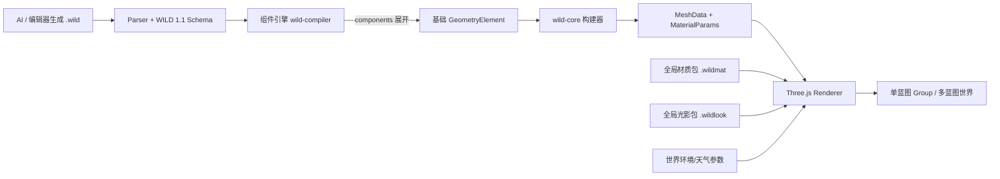

# WILD 蓝图构建类型与引擎能力目录

> 文档分类：WILD 规范与能力目录。返回 [正式文档入口](../README.md)。

最后核对：2026-08-15。  
源码快照：`8427fd1`。  
当前蓝图写入版本：WILD `1.1`。

## 1. 文档目的

本文档回答四个容易混在一起的问题：

1. `.wild` 蓝图当前能表达哪些基础几何类型；
2. 组件引擎当前能编译哪些组合组件；
3. 渲染引擎怎样把几何、材质、光影和天气组合起来；
4. AI 所说的“建筑类型”与真正的蓝图构建类型有什么区别。

本文是能力目录，不重复所有字段级规范。字段格式以 [WILD_BLUEPRINT_SPEC.md](WILD_BLUEPRINT_SPEC.md) 为准，材质世界设计以 [GLOBAL_MATERIAL_WORLD_ARCHITECTURE.md](../materials/GLOBAL_MATERIAL_WORLD_ARCHITECTURE.md) 为准。

发生冲突时，以当前代码为准，优先级为：Core/Compiler 实现、Schema 与类型、自动化测试、本文档。

## 2. 一条完整的构建与渲染链路

各层职责不能互换：

- Blueprint 保存几何、组件、材质语义和引用，不携带 JavaScript、GLSL 或 WGSL；
- 组件引擎只把高层组件确定性展开成 Core 已认识的基础元素；
- Core 负责几何构建和稳定的材质中间描述，不依赖 Three.js；
- Renderer 负责 Three.js 网格、材质、Shader、灯光、天气和 GPU 资源；
- 世界运行时隔离每份蓝图的几何实例，同时全局共享材质、纹理和环境状态。

## 3. 蓝图容器类型

### 3.1 `meta.type`

当前规范允许四种场景语义：

| 值 | 含义 | 说明 |
|---|---|---|
| `building` | 建筑 | 当前 AI 建筑生成的主要交付类型。 |
| `avatar` | 角色 | 可承载 `body` 等几何。 |
| `asset` | 独立资产 | 用于单体构件或可复用资产。 |
| `scene` | 场景 | 用于组合场景，不等同于多蓝图 `wild.world`。 |

`meta.type` 是文档语义，不会替代 `geometry.elements[*].type` 的几何构建器选择。

### 3.2 `geometry` 的四种构建方式

| 构建方式 | 字段 | 当前能力 | 是否直接进入 Core builder |
|---|---|---|---|
| 直接基础元素 | `geometry.elements` | 正式支持，也是 Agent 最终交付主路径 | 是 |
| 组合组件 | `geometry.components` | 正式支持，先经 Compiler 展开 | 否 |
| 模板实例 | `geometry.templates` + `instances` | Core 支持复用；当前 Agent 最终交付仍受限 | 展开后进入 |
| 表面排布 | `geometry.placements` | Core 有网格排布能力；当前 Agent 最终交付仍受限 | 展开后进入 |

模板和实例解决“同一几何重复放置”，组合组件解决“一个业务组件由多个基础几何组成”，两者不是同一种复用机制。

## 4. Core 基础几何构建类型

Core 注册表当前共有 **11 种** `GeometryElement`。状态来自 `wild-core/src/primitive/registry.ts`，不是对建筑用途的主观评级。

| `type` | 当前状态 | 主要能力 | 关键子类型或边界 |
|---|---|---|---|
| `wall` | stable | 直线/曲线墙体、矩形开孔 | `curve` 可为单段或多段；洞口由空间解析器写入内部 cutout。 |
| `floor` | stable | 楼板、平台 | `shape`: `rect` / `circle`。 |
| `column` | partial | 参数化柱体 | `style`: `doric` / `ionic` / `corinthian` / `modern` / `chinese_wooden`；复杂柱式细部未完全覆盖。 |
| `beam` | partial | 直梁或曲梁 | `crossSection`: `rect` / `circular` / `i-beam`。 |
| `roof` | partial | 基础屋顶、中式曲面、重檐屋顶 | `roofType`: `gable` / `hip` / `dome` / `flat` / `chinese_curved` / `chinese_pagoda`。 |
| `opening` | partial | 墙体洞口及覆盖面 | `style`: `rectangular` / `arched` / `gothic` / `circular`；通常由门窗组件产生。 |
| `stair` | stable | 直跑参数化楼梯 | 由起终点、宽度和踏步参数构建。 |
| `furniture` | partial | 基础参数化家具 | `subtype`: `table` / `chair` / `bookshelf` / `bed` / `lamp` / `tile`。 |
| `dense_brick` | experimental | 体素致密几何 | `marching_cubes` / `dual_contouring`；等值面能力仍属实验。它不是红砖墙材质。 |
| `body` | partial | 简化参数化人物 | 体型 `lean` / `athletic` / `stout`，以及头型、肢体比例等。 |
| `primitive` | stable | 通用数学形体 | `shape`: `box` / `sphere` / `cylinder` / `profile_sweep`。新增普通建筑细节时应优先复用它，而不是不断增加专用 element type。 |

状态含义：

- `stable`：注册并作为稳定构建能力使用；
- `partial`：已经实现，但只覆盖当前声明的参数化范围；
- `experimental`：能进入管线，但不应视为稳定生产能力。

## 5. 组件引擎类型

`geometry.components` 当前共有 **10 种** `ComponentSpec`。组件不是新渲染原语；`wild-compiler` 会在不修改源 Blueprint 的前提下把它们展开成 `GeometryElement[]`，再交给 Core。

| `type` | 依附对象 | 编译后的主要基础元素 | 当前交互/说明 |
|---|---|---|---|
| `door` | `parentWall` | `opening` + `primitive.box` 门框 | 单开/双开、矩形/拱形；可编译平开或平移交互。 |
| `window` | `parentWall` | 一个或两个 `opening` + `primitive.box` 窗框/窗棂 | 可配置横竖窗棂；配置交互时左右窗扇分别开合。 |
| `railing` | 世界路径或 `parentFloor` | `primitive.cylinder` 立杆 + `beam.circular` 横杆 | 支持多段、随坡路径与多层横杆。 |
| `canopy` | `parentWall` | `primitive.box` 顶板 + 可选支柱 | 自动解析墙外侧，避免只按固定世界轴外挑。 |
| `balcony` | `parentWall` | `primitive.box` 悬挑板 + 内嵌 `railing` 的编译结果 | 自动生成 U 形栏杆；无需再重复生成独立栏杆。 |
| `ramp` | 世界坐标或 `parentFloor` | `primitive.profile_sweep` 斜面/挡台 + 可选 `railing` | 栏杆可选 `none` / `left` / `right` / `both`。 |
| `bay_window` | `parentWall` | `window` 的编译结果 + `primitive.box` 挑板/前窗/侧窗 | 本质上复用窗组件，再增加外凸体。 |
| `cornice` | 世界路径或 `parentRoof` | `primitive.profile_sweep` | 截面沿路径扫掠；与同标高阳台/雨棚重叠时会分段避让。 |
| `chimney` | 世界坐标或 `parentRoof` | 四面 `primitive.box` 薄壁 + 压顶 | 当前不对屋顶做布尔穿透。 |
| `light` | 世界坐标 | `primitive.sphere/cylinder` 灯具体 +运行时 `PointLight`/`SpotLight` | 外观 `bulb` / `table_lamp`；右键按关闭、弱光、强光循环。 |

组件编译失败时会返回结构化诊断；其他基础元素和成功组件仍可继续重建。生成元素 ID 使用 `<componentId>__...`，因此人工元素不要占用这个命名空间。

### 5.1 为什么后端显示 11 个“组件类型”

后端 AI 注册表当前有 11 个生成分类：

`door`、`window`、`roof`、`railing`、`canopy`、`balcony`、`light`、`ramp`、`bay_window`、`cornice`、`chimney`。

其中 `roof` 被放进组件生成图只是为了并行生成和校验；它带有 `is_element=True`，最终写入 `geometry.elements`，并不会进入 `geometry.components`。因此：

- AI 组件生成分类：11 个；
- Blueprint 组合组件类型：10 个；
- Core 基础元素类型：11 个。

这三个数字恰好接近，但含义完全不同。

## 6. Core 重建引擎的执行阶段

当前 `reconstructEntity()` 的主要顺序是：

1. 归一化输入并迁移到 WILD `1.1`；
2. 展开 `templates` 与 `instances`；
3. 解析墙洞、墙角接缝等空间关系；
4. 展开 `placements`；
5. 按注册表为每个 `GeometryElement` 调用 builder；
6. 生成缺失的平面 UV，并透传拖拽/门窗/灯具交互元数据；
7. 合并符合条件的小屋面瓦片以减少 draw call；
8. 将 Blueprint 材质解析为 `MaterialParams` 与 `RenderMaterialDescriptor`；
9. 计算世界包围盒，并处理旧效果层需要的顶点色烘焙；
10. 输出 `MeshData[]`、逐网格材质参数、包围盒、行为数据和诊断。

Core 输出的是 renderer 无关的数据，不创建 `THREE.Mesh`，也不执行 AI 生成逻辑。

## 7. Three.js 渲染引擎能力

### 7.1 几何渲染

Renderer 把每个 `MeshData` 转为 `THREE.BufferGeometry`，再创建 `THREE.Mesh` 或可实例化网格。主要保护和能力包括：

- 单网格超过 50,000 顶点时用红色线框占位，避免异常几何拖死浏览器；
- 普通材质使用 `THREE.MeshStandardMaterial`；
- 玻璃、透射、清漆或布料效果使用 `THREE.MeshPhysicalMaterial`；
- 网格默认投射并接收阴影，透射材质关闭投射阴影；
- 门窗交互通过网格变换实现，灯具交互会实际创建 `THREE.PointLight` 或 `THREE.SpotLight`；
- 相同几何/材质的实体可走实例化路径，减少 draw call。

### 7.2 材质源类型

Core 当前把表面来源归为四类：

| `source` | 数据来源 | Renderer 路径 |
|---|---|---|
| `constant` | 基础色、粗糙度、金属度等常量 | 默认低成本表面 Shader；玻璃除外。 |
| `procedural` | 参数化程序材质 | 当前只有专用 `brick` Shader。 |
| `texture-set` | PBR 图片通道或材质包 | PBR 贴图 + 世界天气响应 Shader。 |
| `hybrid` | PBR 贴图与程序参数同时存在 | 当前描述符可识别；若含 `brick`，专用砖实现优先。 |

材质表面族共有六种：`neutral`、`mineral`、`masonry`、`wood`、`metal`、`glass`。未显式填写 `surfaceFamily` 时，Core 会按材质类、金属度和材质名称语义推断。

当前 Renderer 注册了三种表面实现：

| 实现 ID | 用途 | 当前状态 |
|---|---|---|
| `surface.default.v1` | 常量材质的默认微变化与天气响应 | 已实现；矿物/砌体、木材、金属使用同一 GPU Program，通过 uniform 区分。 |
| `masonry.brick.v1` | 无贴图程序化砖缝、砖色、磨损与风化 | 已实现；`procedural.type` 目前只支持 `brick`。 |
| `surface.pbr.v1` | PBR 贴图表面的湿润、雨痕、积雪和积尘响应 | 已实现。 |

因此，“当前只有红砖吗”的准确答案是：专用程序化材质类型目前只有 `brick`，但默认表面系统并不只有砖；它已经按矿物/砌体、木材、金属等表面族生成低成本微变化。玻璃主要走 `MeshPhysicalMaterial`，不会套默认微表面噪声。

### 7.3 PBR 通道与物理材质

Blueprint 材质当前支持以下贴图通道：

- `baseColor`；
- `normal`；
- `roughness`；
- `metalness`；
- `ambientOcclusion`。

并支持 `normalScale`、`uvScale`、基础颜色染色、粗糙度、金属度、透明度、透射率、IOR、厚度、衰减色、清漆和布料 sheen。纹理支持 URL、内嵌安全图片以及材质包 URI；KTX2 需要渲染器完成转码器初始化。

Blueprint 还保留四种旧式 `effects` 效果层：`weathering`、`moss`、`edgeWear`、`grain`。它们目前由 Core 做参数混色、粗糙度近似或逐顶点颜色烘焙，不等同于新的专用 GPU Shader 类型；新天气响应应优先使用 `environmentResponse` 和世界环境参数。

### 7.4 默认世界光影、环境与天气

这些参数属于世界/视口运行时，不属于某一栋建筑的几何：

| 类别 | 当前类型 |
|---|---|
| 时间 | `day` / `sunset` / `night` |
| 环境 | `minimal` / `meadow` / `alpine` / `desert` / `autumn` |
| 天气 | `clear` / `cloudy` / `rain` / `fog` / `snow` / `dust` |
| 画质 | `low` / `medium` / `high`；材质协议另有 `fallback` |
| 相机预设 | `corner` / `human` / `bird` / `front` |
| 可选视口特效 | `clouds` / `puddles` / `ripples` / `dustParticles` / `volumetricFog` / `reflections` |

世界环境的连续参数是 `timeOfDay`、`rain`、`wetness`、`snow`、`dust`、`wind`、`cloudCoverage` 和 `fog`。天气预设只是这些参数的预配置；材质通过共享 uniform 响应变化，不需要为每栋建筑重新编译 Shader。

默认材质表面和默认天气可分别启停，并可分别选择 `low` / `medium` / `high` / `fallback`。切换为 `fallback` 时质量因子为 0，相关效果不再贡献最终画面且不会触发 Shader 重编译；已经挂载的 Shader 代码仍可能执行，所以它不是“完全卸载材质程序”。视口级高级特效默认全部关闭。

## 8. 全局材质包与光影包

| 包类型 | 扩展名 | 清单格式 | 作用域 | 当前边界 |
|---|---|---|---|---|
| 材质包 | `.wildmat` | `wild.material-package` `1.0` | 全局材质库 | 提供 PBR 通道、默认参数、表面族和天气响应；不允许携带可执行 Shader 代码。 |
| 光影包 | `.wildlook` | `wild.render-profile` `1.0` | 全局渲染配置 | 选择已注册的 Shader 功能 ID，并设置光照、曝光、阴影、雾和质量档位。 |

两类文件都可使用纯 JSON 清单；需要携带包内资源时使用标准 ZIP/ZIP64 容器，仍保留 `.wildmat` 或 `.wildlook` 扩展名。解析器会拒绝 `shader`、`glsl`、`wgsl`、`script`、`javascript`、`code` 等可执行字段。

材质包支持 `baseColor` 必选通道，以及 `normal`、`roughness`、`metalness`、`ambientOcclusion` 可选通道；图片类型支持 PNG、JPEG、WebP 和 KTX2。导入记录可持久化到 IndexedDB，运行时按 `packageId` 和内容哈希去重。

光影包不是任意代码包。它只能引用 Renderer 已注册的功能 ID；激活新 Profile 后，旧 Profile 创建的运行时资源会被释放。内置默认光影为 `builtin:default`，外部 Profile 不可用时可回退到默认配置。

## 9. 多蓝图隔离与全局共享

当前设计已经明确区分两类状态：

| 必须隔离 | 可以全局共享 |
|---|---|
| 每个蓝图实例的 `THREE.Group`、Transform、可见性、几何和交互状态 | 相同签名的 Three.js 材质与纹理 GPU 资源 |
| 每份蓝图的 `MaterialCache` 引用范围和生命周期 | 已导入 `.wildmat` 注册表及包资源解析 |
| 每个实例的组件到生成元素映射与诊断 | 当前 `.wildlook` Profile、Shader 功能注册表 |
| 每个世界区块中的实例装载状态 | 天气、时间、环境和共享 uniform |

`BlueprintRenderInstance` 为每个实例创建独立根节点和材质引用作用域；底层 `GlobalMaterialResourceRegistry` 对相同材质签名和纹理做引用计数复用。卸载一份蓝图只释放它持有的引用，不会直接销毁其他蓝图仍在使用的资源。

世界级组合由 `wild.world` `1.0` 表达，其中包含蓝图资源、实例、区块、主题、全局材质库、光影 Profile 和环境参数。一份 Blueprint 可以被多个世界实例复用。

## 10. AI 建筑方案类型

以下是后端 `architecture_plan` 的生成策略 Profile，不是 WILD Schema 的几何类型，也不对应新的 Renderer builder：

| Profile | 中文类型 | 支持的主要体量形状 |
|---|---|---|
| `residential_lowrise` | 低层居住建筑 | `rectangle` / `l_shape` / `u_shape` / `stepped` / `courtyard` |
| `ordinary_public` | 普通公共建筑 | 上述常见形状 + `linear` |
| `long_span_public` | 大跨公共建筑 | `rectangle` / `linear` / `radial` / `bowl` / `terminal` |
| `high_rise` | 高层与超高层建筑 | `rectangle` / `stepped` / `tower` / `twin_tower` |
| `underground_transport` | 地下交通建筑 | `rectangle` / `linear` / `underground` |
| `garden_structure` | 园林与景观建筑 | `rectangle` / `l_shape` / `courtyard` / `linear` / `pavilion` |
| `religious_landmark` | 宗教与纪念性建筑 | `rectangle` / `courtyard` / `linear` / `basilica` / `centralized` |

这些 Profile 只负责选择合理的体量范围、楼层表达、结构策略、屋顶默认值和组件配额。最终仍必须落到第 4 节的 11 种基础元素和第 5 节的 10 种组件中。

## 11. 扩展新类型时应修改哪一层

### 11.1 新增基础几何类型

只有无法由现有 `primitive`、墙/板/梁/柱等有限组合稳定表达的新几何原语，才应新增 `GeometryElement.type`。至少需要同步：

1. TypeScript 类型与 WILD Schema；
2. Core builder 与静态注册表；
3. 参数校验、诊断和能力状态；
4. 后端解析、校验、修复和生成约束；
5. Core/Renderer 回归测试与规范文档。

### 11.2 新增组合组件类型

能由已有基础元素组合出来的业务对象，应进入组件引擎。至少需要同步：

1. `ComponentSpec` 与 Schema；
2. `wild-compiler` 编译器及注册表；
3. 依附坐标、ID 映射、材质默认值和失败诊断；
4. 后端 AI 组件注册、校验、修复与配额；
5. 组件编译测试和渲染回归测试。

### 11.3 新增默认表面族或专用 Shader

一般外观变化优先增加数据参数或复用已有表面族，不要为每栋建筑写 Shader。真正新增一种通用材质机制时，应同步：

1. Core 的材质协议、语义族或实现 ID；
2. Renderer 的表面功能注册实现；
3. 质量回退、Program 缓存键和共享 uniform；
4. Shader 编译测试、不同 Three.js 版本兼容测试和视觉回归；
5. AI 参数生成白名单与文档。

具体实现仍留在 Renderer，Core 只声明稳定的 `RenderMaterialDescriptor`，从而避免几何核心绑定 Three.js/WebGL。

## 12. 当前能力边界总结

- 建筑几何的正式主路径是：10 种组合组件编译为 11 种基础元素，再由 Core 输出网格；
- `roof` 是基础元素，虽然 AI 图把它当作一个并行生成分类；
- `dense_brick` 是实验性体素几何，`procedural.type = "brick"` 是程序化表面材质，两者不要混淆；
- 专用无贴图材质目前只有砖，但默认 Shader 已覆盖多种通用表面族；
- `ramp` 的当前实际编译结果是 `profile_sweep` 斜面；组件能力注册表中的“矩形梁体”属于旧描述，运行行为应以编译器实现为准；
- PBR 材质、程序化表面和天气响应最终统一落到 Three.js 标准/物理材质及注册的 Shader 功能上；
- `.wildmat` 是全局材质资产包，`.wildlook` 是全局光影配置包，两者都不能携带任意可执行代码；
- 多份蓝图的几何与交互相互隔离，材质/纹理资源、光影 Profile 和环境状态全局共享；
- AI 建筑 Profile 是生成策略，不是新的几何、组件或渲染类型。

## 13. 主要源码索引

| 主题 | 源码位置 |
|---|---|
| Blueprint、基础元素、组件和材质类型 | `wild-web/src/wild-core/types.ts` |
| WILD JSON Schema | `wild-web/wild-lang/schema.json` |
| Core 基础元素注册表 | `wild-web/src/wild-core/src/primitive/registry.ts` |
| Core 重建主流程 | `wild-web/src/wild-core/src/primitive/index.ts` |
| 组件编译主流程与注册表 | `wild-web/src/wild-compiler/index.ts`、`componentRegistry.ts` |
| 后端 AI 组件生成注册表 | `wild-server/app/agent/component_registry.py` |
| AI 建筑方案 Profile | `wild-server/app/agent/architecture_plan.py` |
| Core 材质合同与描述符 | `wild-web/src/wild-core/src/materials/contracts.ts`、`descriptor.ts` |
| Three.js 材质适配 | `wild-web/src/renderer/materialAdapter.ts` |
| Renderer 表面功能注册表 | `wild-web/src/renderer/materialFeatures/registry.ts` |
| 默认表面、PBR 天气响应、专用砖 Shader | `wild-web/src/renderer/materialFeatures/`、`proceduralMaterials/` |
| 世界材质与光影运行时 | `wild-web/src/renderer/worldMaterialRuntime.ts`、`worldLookRuntime.ts` |
| 世界天气与环境运行时 | `wild-web/src/renderer/worldWeatherRuntime.ts`、`worldEnvironmentRuntime.ts` |
| 单蓝图实例隔离与多蓝图世界 | `wild-web/src/renderer/blueprintRenderInstance.ts`、`worldRuntime.ts` |
| `.wildmat` / `.wildlook` 解析 | `wild-web/src/renderer/worldPackageImport.ts`、`wild-core/src/materials/packageParser.ts` |
