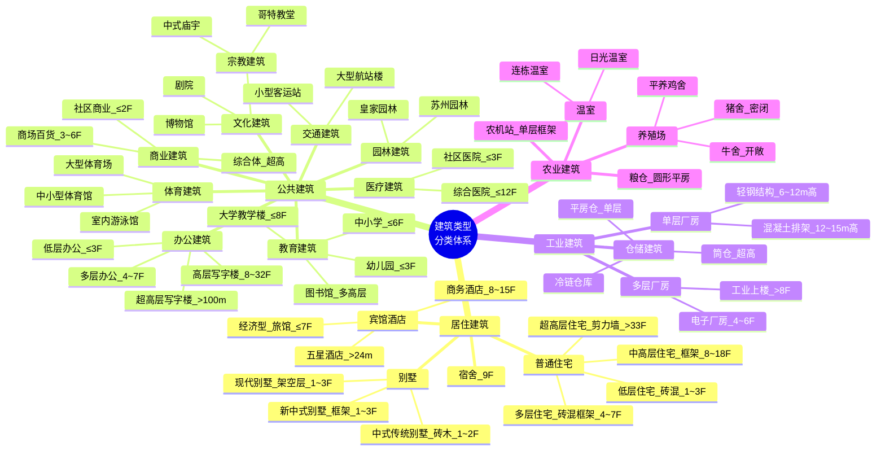

# 建筑类型知识索引

> 来源：`docs/建筑类型分类体系_构件清单版1.2.md`。
> 用途：记录“生成什么建筑”时的语义分类、默认构件组合和建筑大类入口。
> RAG 关键词：建筑类型、居住建筑、公共建筑、工业建筑、农业建筑、分类体系

---
## 建筑分类思维导图

> 四大类 → 16 种子类 → 各自按**层高**和**风格**继续下钻。每种子类在本手册中对应一套完整的 WILD 构件配方。

---

## 当前拆分

| 子目录 | 内容 |
|---|---|
| `catalog/` | 轻量建筑类型入口：别墅、木屋、凉亭、庭院、塔楼等默认参考 |
| `residential/` | 别墅、普通住宅、宿舍、酒店等居住或类居住建筑 |
| `public/` | 教育、办公、文化、商业、体育、医疗、交通、园林纪念司法等公共建筑 |
| `industrial/` | 单层重工业厂房、工业上楼、仓储建筑 |
| `agricultural/` | 温室、畜禽饲养场、粮仓、农机站 |
